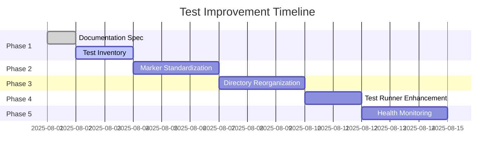

# Automated Test Improvement Plan

## 1. Current State Analysis

### Strengths
- Comprehensive test coverage across core functionality
- Modern pytest-based infrastructure with async support
- Docker integration for realistic testing environments
- Clear testing philosophy documented in `testing-strategy-right-way.md`

### Areas for Improvement
- **Organizational Structure**: Tests scattered without clear categorization
- **Execution Complexity**: Multiple entry points and scripts
- **Reliability**: Flaky tests and inconsistent timeouts
- **Documentation**: Fragmented guidance across multiple files
- **Technical Debt**: Legacy shell scripts and inconsistent patterns

## 2. Phased Implementation Plan



### Phase 1: Foundation (Current Phase)
- Create this specification document
- Complete test inventory with categorization
- Identify all flaky tests

### Phase 2: Marker Standardization
- Apply consistent pytest markers:
  - `@pytest.mark.unit`
  - `@pytest.mark.integration`
  - `@pytest.mark.e2e`
- Verify 100% marker coverage

### Phase 3: Structural Reorganization
```bash
tests/
├── unit/               # Unit tests (isolated components)
├── integration/        # Integration tests (service interactions)
├── e2e/                # End-to-end tests
│   ├── browser/        # Playwright-based UI tests
│   └── api/            # API journey tests
├── shared/             # Fixtures and utilities
└── TEST_GUIDE.md       # Single testing reference
```

### Phase 4: Runner Enhancement
- Update `test-automated.py` to support:
  ```bash
  ./test-automated.py --layer unit
  ./test-automated.py --layer integration
  ./test-automated.py --layer e2e
  ```
- Deprecate legacy test scripts

### Phase 5: Health Monitoring
- Implement test health dashboard:
  - Test distribution across pyramid layers
  - Flaky test identification
  - Coverage gap analysis
- Establish monthly audit process

## 3. Detailed Specification

### Test Structure Convention
```python
# tests/unit/auth/test_token_validation.py
import pytest

@pytest.mark.unit
def test_jwt_validation():
    """Test JWT token validation logic"""
    # Test implementation
```

### Naming Standards
- Files: `test_<module>_<behavior>.py`
- Tests: `def test_<function>_<condition>_<expected_result>()`

### Fixture Management
- Centralized in `tests/shared/fixtures/`
- Categorized by domain (auth, chat, kb, etc.)

## 4. Validation Criteria

- [ ] All existing tests pass after each phase
- [ ] CI/CD pipelines maintain functionality
- [ ] Test execution time not increased by >10%
- [ ] 100% of tests have proper pyramid markers
- [ ] Documentation consolidated to TEST_GUIDE.md

## 5. Risk Mitigation

| Risk | Mitigation Strategy |
|------|---------------------|
| Functionality regression | Dual execution during transition |
| Increased test flakiness | Temporary test quarantine process |
| Pipeline failures | Phase branches with quick revert |
| Knowledge loss | Paired programming for critical sections |
| Scope creep | Strict phase completion criteria |

## 6. Maintenance Plan

- Monthly health reports
- Automated test audits
- Documentation reviews
- Technical debt tracking
