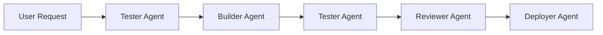
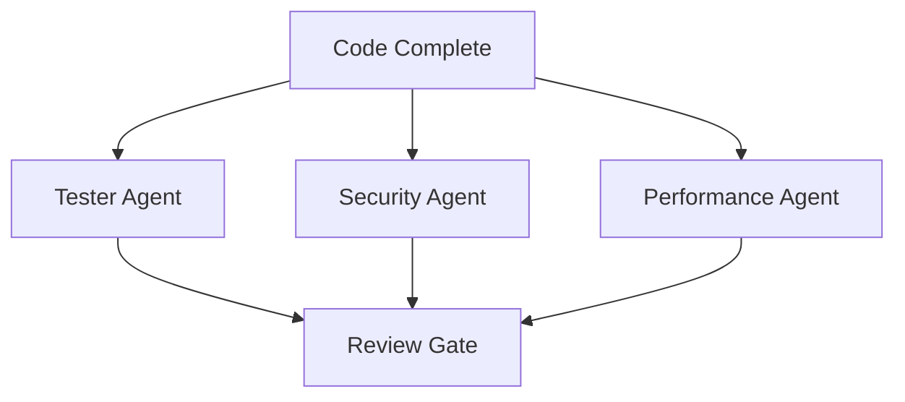

# GAIA Platform Agent Architecture

> A comprehensive guide to using Claude Code agents effectively for the GAIA platform development.

## Quick Links
- [How to Invoke Agents](how-to-invoke-agents.md) - Practical guide for using agents
- [Agent Directory](/.claude/agents/) - Where agents are defined
- [Documentation Agents](.) - Legacy documentation (agents now in `.claude/agents/`)

## Agent File Structure

Claude Code agents are stored in the `.claude/agents/` directory:

```
.claude/
├── agents/
│   ├── tester.md        # Test writing and debugging
│   ├── builder.md       # Code implementation
│   ├── reviewer.md      # Code review and security
│   └── AGENT_TEMPLATE.md # Template for new agents
└── commands/            # Slash commands (future)
```

Each agent is a Markdown file with YAML frontmatter defining:
- `name`: Agent's display name
- `description`: One-line purpose
- `version`: Semantic version
- `permissions`: File access permissions
- `tools`: Available tools

## Overview

The GAIA platform uses specialized Claude Code agents to handle different aspects of development. This architecture promotes modularity, clear responsibilities, and efficient workflows.

## Agent Philosophy

### Core Principles
1. **Single Responsibility**: Each agent has one clear purpose
2. **Explicit Boundaries**: Agents know what they must and must not do
3. **Structured Communication**: Clear handoff patterns between agents
4. **State Preservation**: Explicit state passing between agents
5. **Validation Gates**: Quality checks at each handoff point

### When to Use Agents

**Use Agents When:**
- Task has clear boundaries and deliverables
- Work can be modularized
- Multiple perspectives are valuable
- Parallel work streams are possible
- Specialized expertise is needed

**Use Direct Claude When:**
- Exploring or debugging issues
- Need broad context awareness
- Interactive problem-solving
- One-off tasks or quick fixes
- Cross-cutting concerns

## Current Agent Roster

### 1. Tester Agent
- **Purpose**: Write tests, run tests, debug failures
- **Expertise**: Testing patterns, async execution, E2E testing
- **Outputs**: Test code, test results, debugging insights
- **[Full Documentation](tester.md)**

### 2. Builder Agent (Coming Soon)
- **Purpose**: Implement features and fix bugs
- **Expertise**: Code patterns, architecture, best practices
- **Outputs**: Implementation code, refactored code

### 3. Reviewer Agent (Coming Soon)
- **Purpose**: Review code quality and correctness
- **Expertise**: Security, performance, code standards
- **Outputs**: Review comments, approval status

### 4. Deployer Agent (Planned)
- **Purpose**: Handle deployments and infrastructure
- **Expertise**: CI/CD, cloud platforms, monitoring
- **Outputs**: Deployment logs, environment status

## Agent Communication Patterns

### Sequential Pipeline


### Parallel Validation


### Handoff Protocol

#### Input Format
```
=== [RECEIVING_AGENT] TASK BEGIN ===
CONTEXT: [What has been done so far]
OBJECTIVE: [What needs to be done]
CONSTRAINTS: [Any limitations or requirements]
DATA:
[Relevant data, code, or test results]
=== [RECEIVING_AGENT] TASK END ===
```

#### Output Format
```
=== [SENDING_AGENT] RESULTS BEGIN ===
STATUS: [SUCCESS|PARTIAL|FAILED]
SUMMARY: [What was accomplished]
DATA:
[Output data, code, or results]
NEXT_STEPS: [Recommendations for next agent]
=== [SENDING_AGENT] RESULTS END ===
```

## Practical Workflows

### Test-Driven Development (TDD)
```bash
# 1. Define the feature
User: "I need a new endpoint to list user preferences"

# 2. Tester writes tests
User: "Use the Tester Agent to write tests for GET /api/preferences"
Tester: Creates comprehensive test suite

# 3. Builder implements
User: "Use the Builder Agent to implement the preferences endpoint"
Builder: Implements code to pass tests

# 4. Validate
User: "Use the Tester Agent to run all tests"
Tester: Runs tests, confirms passing

# 5. Review
User: "Use the Reviewer Agent to check the implementation"
Reviewer: Reviews for quality and security
```

### Bug Fix Workflow
```bash
# 1. Reproduce
User: "Use the Tester Agent to write a test that reproduces bug #123"

# 2. Fix
User: "Use the Builder Agent to fix the bug"

# 3. Verify
User: "Use the Tester Agent to confirm the bug is fixed"

# 4. Regression
User: "Use the Tester Agent to ensure no regressions"
```

### Feature Development
```bash
# 1. Specification
User: Provides feature requirements

# 2. Test Design
Tester Agent: Writes comprehensive test suite

# 3. Implementation
Builder Agent: Implements feature incrementally

# 4. Integration
Tester Agent: Runs integration tests

# 5. Review
Reviewer Agent: Validates implementation

# 6. Documentation
Documenter Agent: Updates docs
```

## Context Management Best Practices

### 1. Scope Reduction
```bash
# Bad: Entire repository context
Use the Tester Agent to write tests

# Good: Focused context
Use the Tester Agent to write tests for services/chat/api.py
Focus only on the /v1/chat endpoint
```

### 2. State Summaries
```bash
# When switching agents
"The Tester Agent has written 5 tests for the preferences endpoint.
All tests are currently failing as expected.
Use the Builder Agent to implement the endpoint in services/web/routes/preferences.py"
```

### 3. Clear Objectives
```bash
# Bad: Vague request
"Fix the tests"

# Good: Specific objective
"Use the Tester Agent to update the test_chat_response test to handle the new streaming format"
```

## Performance Optimization

### 1. Parallel Agent Execution
When tasks are independent, run agents in parallel:
```bash
# Run these simultaneously
- Tester Agent: Write unit tests
- Builder Agent: Update documentation
- Reviewer Agent: Review previous PR
```

### 2. Context Caching
Reuse agent sessions when working on related tasks:
```bash
# Continue in same session
"Now update the tests for the DELETE endpoint"
```

### 3. Batch Operations
Group related tasks for efficiency:
```bash
# Single agent invocation
"Use the Tester Agent to:
1. Write tests for all CRUD endpoints
2. Include error cases
3. Add performance tests"
```

## Debugging Agent Issues

### Common Problems and Solutions

1. **Agent Overstepping Boundaries**
   - Solution: Add explicit "DO NOT" instructions
   - Example: "DO NOT modify existing tests"

2. **Lost Context Between Handoffs**
   - Solution: Use structured handoff format
   - Include explicit state summaries

3. **Inconsistent Outputs**
   - Solution: Define strict output formats
   - Validate outputs before handoff

4. **Performance Degradation**
   - Solution: Limit context scope
   - Use focused file paths

### Debug Checklist
- [ ] Is the agent role clearly defined?
- [ ] Are boundaries explicitly stated?
- [ ] Is the context focused and relevant?
- [ ] Are handoffs using structured format?
- [ ] Is state being preserved between agents?

## Future Enhancements

### Planned Agents
1. **Security Agent**: Security scanning and vulnerability assessment
2. **Performance Agent**: Performance testing and optimization
3. **Documentation Agent**: API docs, README updates
4. **Migration Agent**: Database migrations, version upgrades

### Tooling Improvements
1. **Agent Orchestrator**: Automated workflow management
2. **State Manager**: Persistent state between sessions
3. **Validation Framework**: Automated handoff validation
4. **Performance Monitor**: Agent execution metrics

## Best Practices Summary

1. **Be Explicit**: Clear instructions and boundaries
2. **Maintain Focus**: One task per agent invocation
3. **Structure Communication**: Use defined formats
4. **Preserve State**: Pass context explicitly
5. **Validate Outputs**: Check results before handoff
6. **Optimize Context**: Only include necessary files
7. **Document Workflows**: Capture successful patterns

## Example Agent Invocations

### Simple Test Writing
```
Use the Tester Agent to write unit tests for the new calculate_discount function in services/pricing/utils.py
```

### Complex Feature Development
```
=== TESTER AGENT TASK BEGIN ===
CONTEXT: We're adding a new feature for bulk user import
OBJECTIVE: Write comprehensive tests for the bulk import endpoint
CONSTRAINTS: 
- Must test CSV and JSON formats
- Include validation error cases
- Test rate limiting
- Maximum 1000 users per import
DATA:
Endpoint: POST /api/v1/users/bulk-import
=== TESTER AGENT TASK END ===
```

### Multi-Agent Coordination
```
I need to refactor the authentication system. Let's start:

1. Use the Tester Agent to write tests for the new token refresh endpoint
2. Once tests are written and failing, I'll use the Builder Agent
3. After implementation, we'll use the Reviewer Agent for security review
```

## Conclusion

Effective agent usage in Claude Code requires:
- Clear role definition and boundaries
- Structured communication patterns
- Focused context management
- Explicit state preservation
- Systematic workflows

By following these patterns, the GAIA platform can leverage specialized agents for efficient, high-quality development while maintaining clear separation of concerns and traceability throughout the development process.