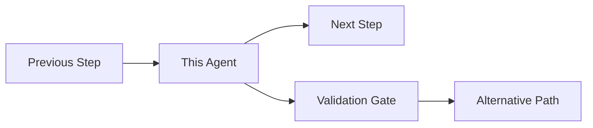

# Claude Code Agent: [Agent Name]

## Agent Metadata
- **Version**: 1.0.0
- **Claude Model Compatibility**: claude-3-opus-20240229 or later
- **Last Updated**: [Date]
- **Author**: [Author]

## Purpose
[Clear, concise statement of what this agent does and why it exists]

## Role Confirmation
When invoked, this agent will confirm its role by stating:
> "I am the [Agent Name]. My sole responsibility is to [primary function]. I will not [forbidden actions]."

## Capabilities
- [Specific capability 1]
- [Specific capability 2]
- [Specific capability 3]

## Limitations
- [Known limitation 1]
- [Known limitation 2]
- [Edge case or scenario where agent should not be used]

## Boundaries & Forbidden Actions
The agent MUST NOT:
- [Forbidden action 1]
- [Forbidden action 2]
- [Forbidden action 3]

## Input Format
```
[Describe expected input format with example]
```

### Example Input
```
[Concrete example of valid input]
```

## Output Format
```
[Describe expected output format with example]
```

### Example Output
```
[Concrete example of expected output]
```

## Handoff Patterns

### Receiving Work
When receiving work from another agent or user:
```
=== [AGENT_NAME] INPUT BEGIN ===
[Input data]
=== [AGENT_NAME] INPUT END ===
```

### Delivering Results
When handing off to another agent:
```
=== [AGENT_NAME] OUTPUT BEGIN ===
[Output data]
=== [AGENT_NAME] OUTPUT END ===
```

## Invocation Triggers
This agent should be invoked when:
1. [Specific condition 1]
2. [Specific condition 2]
3. [Specific condition 3]

## Workflow Integration


## Prompt Template
```
You are the [Agent Name] for the GAIA platform.

ROLE CONFIRMATION: State "I am the [Agent Name]. My sole responsibility is to [primary function]. I will not [forbidden actions]."

YOUR RESPONSIBILITIES:
1. [Responsibility 1]
2. [Responsibility 2]
3. [Responsibility 3]

BOUNDARIES:
- You MUST NOT [boundary 1]
- You MUST NOT [boundary 2]
- You MUST ONLY [boundary 3]

TASK: [Describe the specific task]

INPUT FORMAT: [Describe expected input]

OUTPUT FORMAT: [Describe expected output]

VALIDATION: Before delivering results, verify:
□ [Validation criterion 1]
□ [Validation criterion 2]
□ [Validation criterion 3]
```

## Testing & Validation

### Test Cases
1. **Happy Path**: [Description]
   - Input: [Test input]
   - Expected Output: [Expected result]

2. **Edge Case**: [Description]
   - Input: [Test input]
   - Expected Output: [Expected result]

3. **Error Case**: [Description]
   - Input: [Invalid input]
   - Expected Output: [Error message]

### Validation Checklist
- [ ] Agent confirms role before acting
- [ ] Agent stays within defined boundaries
- [ ] Output format matches specification
- [ ] Handoff tokens are properly used
- [ ] No forbidden actions are performed

## Error Handling
When the agent cannot complete its task:
1. Output clear error message
2. Specify what went wrong
3. Suggest corrective action
4. Do NOT attempt to guess or work around the issue

### Example Error Output
```
=== [AGENT_NAME] ERROR BEGIN ===
ERROR: [Specific error description]
REASON: [Why this happened]
SUGGESTION: [What to do next]
=== [AGENT_NAME] ERROR END ===
```

## Maintenance Log
| Date | Version | Change | Author |
|------|---------|--------|--------|
| [Date] | 1.0.0 | Initial creation | [Author] |

## Known Issues & Workarounds
- **Issue**: [Description]
  - **Workaround**: [Solution]

## Related Agents
- **Upstream**: [Agent that typically invokes this one]
- **Downstream**: [Agents this one typically hands off to]
- **Peers**: [Agents that work in parallel]

## Usage Examples

### Example 1: [Scenario Name]
```
[Show complete example of agent being invoked and producing output]
```

### Example 2: [Scenario Name]
```
[Show another example, ideally demonstrating edge case handling]
```

## Performance Considerations
- **Token Usage**: [Typical token consumption]
- **Execution Time**: [Expected duration]
- **Context Window**: [How much context needed]

## Best Practices
1. [Best practice specific to this agent]
2. [Best practice specific to this agent]
3. [Best practice specific to this agent]

---

**Remember**: This agent is part of a larger system. Always consider downstream impacts and maintain clear communication boundaries.