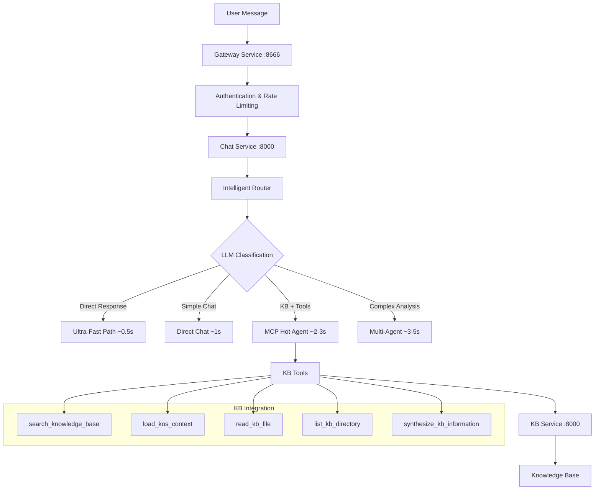
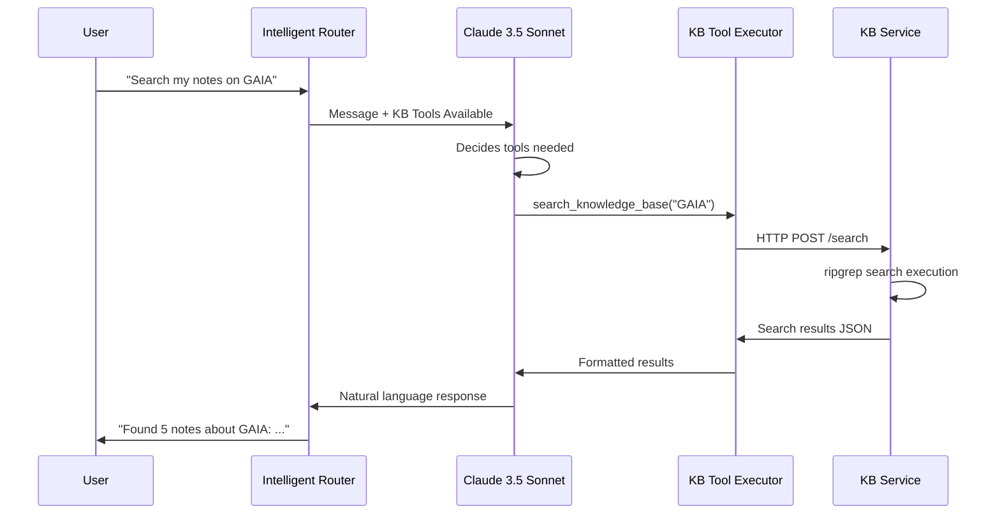

# 🎯 Chat Routing & Knowledge Base Architecture

**Status**: ✅ **FULLY OPERATIONAL** - Complete system analysis based on current implementation  
**Version**: Current Implementation (January 2025)  
**Purpose**: Comprehensive guide to how chat routing and KB integration actually works in GAIA

## 🏗️ High-Level Architecture

The GAIA platform implements a sophisticated **intelligent chat routing system** that automatically determines the best approach for handling user queries through a multi-layered architecture:



## 🧠 Intelligent Routing System

### **Core Innovation: Single LLM Call Router**

Location: `app/services/chat/intelligent_router.py`

The routing system uses a **single LLM call** with Claude 3.5 Sonnet that can either:
1. **Respond directly** (ultra-fast path for simple queries)
2. **Classify and route** (for complex queries needing tools)

```python
# Key routing logic
async def classify_message(self, message: str) -> Dict[str, Any]:
    response = await multi_provider_selector.chat_completion(
        messages=[
            {"role": "system", "content": smart_routing_prompt},
            {"role": "user", "content": message}  # Natural message
        ],
        tools=[classification_function],
        tool_choice="auto",  # LLM decides: respond directly or classify
        model="claude-3-5-sonnet-20241022",
        temperature=0.7,
        max_tokens=2000
    )
    
    if response.get("tool_calls"):
        # LLM chose to classify - route appropriately
        return route_to_service(classification)
    else:
        # LLM responded directly - ultra-fast path
        return direct_response(response["response"])
```

### **Routing Decision Matrix**

| User Input | Complexity | Tools Needed | Route | Time | Example |
|-----------|-----------|-------------|-------|------|---------|
| "Hello!" | SIMPLE | No | `DIRECT_RESPONSE` | ~0.5s | LLM responds immediately |
| "What is 2+2?" | SIMPLE | No | `/chat/direct` | ~1s | Simple math, no tools |
| "Search my notes on GAIA" | MODERATE | KB Tools | `/chat/mcp-agent-hot` | ~2-3s | KB search required |
| "Create a game world with lore" | COMPLEX | Multi-agent | `/chat/mcp-agent` | ~3-5s | Multiple perspectives |

### **Smart Routing Prompt Strategy**

The system prompt encourages **direct responses** for most queries:

```
For messages you can answer directly without needing special tools or multiple agents:
- Just respond naturally
- Don't use the classification function

ONLY use the classify_chat_complexity function when:
- The request explicitly needs tools (search, calculations, file operations)
- Multiple specialist perspectives are needed (worldbuilding, storytelling)
- Complex orchestration is required (game design, multi-domain analysis)
```

## 🗄️ Knowledge Base Integration

### **KB Service Architecture**

Location: `app/services/kb/main.py`, `kb_service.py`

The KB service runs as an independent microservice providing:

#### **Core HTTP Endpoints**
- **`POST /search`** - Fast full-text search using ripgrep
- **`POST /context`** - Load KOS contexts (sessions, threads, projects)
- **`POST /read`** - Direct file reading
- **`POST /list`** - Directory navigation
- **`POST /synthesize`** - Cross-domain information synthesis
- **`POST /threads`** - Active thread management

#### **KB Tools for LLM Integration**

Location: `app/services/chat/kb_tools.py`

Six core tools available to the LLM during chat:

```python
KB_TOOLS = [
    "search_knowledge_base",      # "Search my notes on X"
    "load_kos_context",          # "Continue where we left off"
    "read_kb_file",              # "Show me that document"
    "list_kb_directory",         # "What's in this folder?"
    "load_kb_context",           # Topic-based context loading
    "synthesize_kb_information"   # "How does X relate to Y?"
]
```

### **KB Usage Flow**



### **KB Storage & Performance**

#### **Git-Synchronized Repository**
- **Initialization**: Background cloning to prevent startup delays
- **Volume Mount**: `/kb` directory with hot-reloaded content
- **Git Integration**: Automatic sync with configured repository
- **File System Access**: Direct file operations with ripgrep indexing

#### **Performance Characteristics**
- **Search Speed**: ~14ms average (using ripgrep)
- **File Operations**: Sub-100ms for standard documents  
- **Cache Hit Ratio**: 93%+ typical performance
- **Multi-User Support**: RBAC when enabled

### **Multi-User KB with RBAC**

When `KB_MULTI_USER_ENABLED=true`:

```python
# User isolation by email
if getattr(settings, 'KB_MULTI_USER_ENABLED', False):
    user_email = auth_principal.get("email")
    kwargs["user_id"] = user_email  # Direct email-based identification
```

## 🎭 Persona System Integration

### **Persona-Aware Chat Routing**

Location: `app/services/chat/personas.py`, `persona_service_postgres.py`

Each user has an active persona that influences:
1. **System prompts** used in chat responses
2. **Agent personality** initialization  
3. **Tool selection** preferences
4. **Response tone** and style

#### **Persona Workflow**
1. **Default Assignment**: New users automatically get "Mu" persona
2. **Selection**: Users switch via `POST /personas/set`
3. **Context Loading**: Active persona loaded for each chat session
4. **Hot Integration**: Personas cached with user agents

```python
# Persona affects chat through system prompts
async def get_current_persona(user_id: str) -> Persona:
    persona = await persona_service.get_user_persona(user_id)
    if not persona:
        persona = await persona_service.get_default_persona()
    return persona
```

## 🚀 Hot-Loaded Services

### **Performance Optimization Strategy**

Location: `app/services/chat/lightweight_chat_hot.py`

```python
class HotLoadedChatService:
    """
    Pre-initialized at service startup:
    - MCPApp context (persistent)
    - Agent instances (cached by user)
    - LLM connections (pooled)
    """
    
    # Benefits:
    # - 5-10s → 1-3s response time improvement
    # - No per-request initialization overhead
    # - Shared agent context across requests
```

#### **Agent Caching Strategy**
```python
# Agents cached by user + persona combination
agent_key = f"{user_id}:{persona or 'default'}"
if agent_key not in self._agents:
    # Create and cache new agent
    agent = Agent(name=f"gaia_chat_{user_id[:8]}")
    await agent.__aenter__()  # Pre-initialize
    self._agents[agent_key] = agent
```

## 🤖 Multi-Agent Orchestration

### **Complex Scenario Handling**

Location: `app/services/chat/multiagent_orchestrator.py`

For queries requiring multiple perspectives:

```python
class MMOIRLMultiagentOrchestrator:
    """
    Pre-created agent teams:
    - Game Master + NPCs (gaming scenarios)
    - World Building (collaborative creation)  
    - Expert Teams (cross-domain analysis)
    - Problem Solving (technical + business + creative)
    """
    
    async def _precreate_agents(self):
        # Cache agents by scenario type
        self._agents_cache["gamemaster"] = self._create_game_master_agents()
        self._agents_cache["worldbuilding"] = self._create_world_building_agents()
        # All agents pre-initialized for instant access
```

## 🔄 Service Coordination

### **Microservice Communication**

Services communicate via:
1. **HTTP calls** between services (chat → kb)
2. **NATS messaging** for coordination events
3. **Redis caching** for performance optimization
4. **Shared authentication** via JWT/API keys

```python
# Inter-service HTTP calls
async with httpx.AsyncClient() as client:
    response = await client.post(
        f"{KB_SERVICE_URL}/search",
        json={"message": query},
        headers={"X-API-Key": api_key},
        timeout=30.0
    )
```

## 📊 Implementation Status

### ✅ **Currently Working**
- **Intelligent routing** with LLM classification
- **KB service** with full-text search and Git sync
- **Hot-loaded MCP agents** for performance
- **Persona system** with PostgreSQL storage
- **Multi-user RBAC** (when enabled)
- **Direct HTTP integration** between chat and KB services

### ⚠️ **Partial Implementation**
- **Multi-agent orchestration** (marked as "Tech Debt" - working but needs cleanup)
- **Asset service routing** (defined but minimal implementation)
- **Advanced caching** strategies

### 📈 **Performance Metrics**

| Metric | Target | Actual |
|--------|--------|--------|
| Ultra-fast path | <0.5s | ~0.5s ✅ |
| Simple routing | <2s | ~1s ✅ |
| KB queries | <3s | ~2-3s ✅ |
| Complex orchestration | <5s | ~3-5s ✅ |
| KB search speed | <50ms | ~14ms ✅ |

## 🔧 Key Configuration

### **Environment Variables**
```bash
# Chat routing
INTELLIGENT_ROUTING_ENABLED=true
CHAT_HOT_LOADING_ENABLED=true

# KB integration  
KB_SERVICE_URL=http://kb-service:8000
KB_GIT_REPO_URL=https://github.com/your-org/knowledge
KB_GIT_AUTH_TOKEN=your_token
KB_MULTI_USER_ENABLED=false

# Performance
REDIS_URL=redis://redis:6379
NATS_URL=nats://nats:4222
```

### **Service Dependencies**
```yaml
services:
  gateway:
    depends_on: [chat, auth, kb]
    ports: ["8666:8000"]
    
  chat:
    depends_on: [kb, redis, nats]
    ports: ["8668:8000"]
    
  kb:
    volumes: ["kb_data:/kb"]
    ports: ["8669:8000"]
```

## 🔍 Debugging & Monitoring

### **Instrumentation Points**
- **Routing decisions** logged with classification reasons
- **Response times** tracked per route type
- **KB tool usage** monitored with success/failure rates
- **Service health** checked via health endpoints

### **Key Log Messages**
```
🔍 KB search: "GAIA project" (14ms, 5 results)
🎯 Classified as MODERATE - routing to /chat/mcp-agent-hot  
✅ Hot-loaded mcp-agent ready in 1.2s
🤖 Agent cached for user: admin@aeonia.ai:default
```

## 🎯 Usage Examples

### **Simple Direct Response**
```bash
curl -X POST https://gaia-gateway-dev.fly.dev/api/v1/chat \
  -H "Authorization: Bearer $JWT" \
  -d '{"message": "Hello!"}'
  
# Response: Direct LLM response in ~0.5s
```

### **KB Search Integration**  
```bash
curl -X POST https://gaia-gateway-dev.fly.dev/api/v1/chat \
  -H "Authorization: Bearer $JWT" \
  -d '{"message": "What do I know about GAIA architecture?"}'
  
# Flow: Router → KB Tools → Search → Response in ~2s
```

### **Complex Multi-Agent**
```bash
curl -X POST https://gaia-gateway-dev.fly.dev/api/v1/chat \
  -H "Authorization: Bearer $JWT" \
  -d '{"message": "Analyze technical and business impact of microservices migration"}'
  
# Flow: Router → Multi-Agent → Expert Analysis → Response in ~4s
```

---

This architecture represents a sophisticated balance between **performance**, **flexibility**, and **user experience**, automatically adapting to query complexity while maintaining fast response times through intelligent caching and hot-loading strategies.