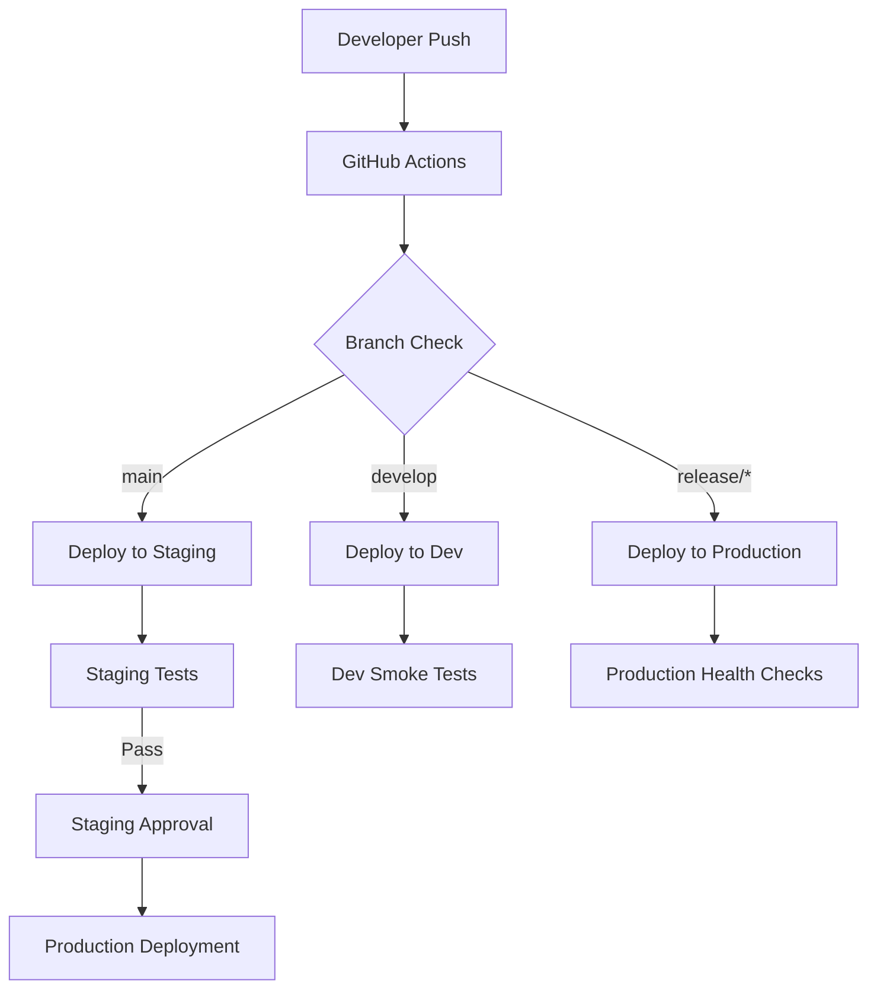

# Gaia Platform Multi-Environment Deployment Strategy

## 🌍 **Environment Overview**

### **Development Environment**
- **Purpose**: Rapid development and testing
- **Infrastructure**: Hybrid local + cloud
- **Scaling**: Auto-sleep, minimal resources
- **Data**: Test data, frequent resets allowed

### **Staging Environment** 
- **Purpose**: Production-like testing and validation
- **Infrastructure**: Full cloud deployment
- **Scaling**: Scheduled, production-like resources
- **Data**: Production-like data, stable datasets

### **Production Environment**
- **Purpose**: Live user traffic
- **Infrastructure**: High-availability cloud deployment
- **Scaling**: Auto-scaling, high-performance resources
- **Data**: Live user data, strict data protection

## 🏗️ **Service Architecture Per Environment**

```
┌─────────────────────────────────────────────────────────────────┐
│                    ENVIRONMENT TOPOLOGY                        │
├─────────────────┬─────────────────┬─────────────────────────────┤
│   DEVELOPMENT   │     STAGING     │        PRODUCTION           │
├─────────────────┼─────────────────┼─────────────────────────────┤
│ Gateway (dev)   │ Gateway (stg)   │ Gateway (prod) x2+ instances│
│ Auth (dev)      │ Auth (stg)      │ Auth (prod) x2+ instances   │
│ Asset (dev)     │ Asset (stg)     │ Asset (prod) x2+ instances  │
│ Chat (dev)      │ Chat (stg)      │ Chat (prod) x2+ instances   │
│                 │                 │                             │
│ DB: gaia-db-dev │ DB: gaia-db-stg │ DB: gaia-db-prod (HA)      │
│ NATS: shared    │ NATS: dedicated │ NATS: clustered             │
└─────────────────┴─────────────────┴─────────────────────────────┘
```

## 🔄 **Service Coordination Strategy**

### **Service Discovery**
- **Fly.io Internal DNS**: `gaia-{service}-{env}.flycast`
- **External URLs**: `https://gaia-{service}-{env}.fly.dev`
- **Health-based routing**: Services register availability via health checks

### **Inter-Service Communication**
```yaml
Gateway Routes:
  - /api/v1/auth/* → Auth Service
  - /api/v1/assets/* → Asset Service  
  - /api/v1/chat/* → Chat Service
  - /health → Gateway Health (aggregates all services)

Service-to-Service:
  - Direct HTTPS calls via Fly.io internal network
  - NATS for async messaging and coordination
  - Circuit breaker pattern for resilience
```

### **Environment-Specific Configuration**
```bash
# Development
AUTO_STOP=true
MIN_MACHINES=0
LOG_LEVEL=DEBUG
HEALTH_CHECK_INTERVAL=30s

# Staging  
AUTO_STOP=suspend
MIN_MACHINES=1
LOG_LEVEL=INFO
HEALTH_CHECK_INTERVAL=15s

# Production
AUTO_STOP=false
MIN_MACHINES=2
LOG_LEVEL=WARNING
HEALTH_CHECK_INTERVAL=10s
```

## 🗄️ **Database & Infrastructure Strategy**

### **Database Deployment**
```
Development:
├── Single PostgreSQL instance (gaia-db-dev)
├── Shared across all dev services
└── Data resets allowed for testing

Staging:
├── Dedicated PostgreSQL instance (gaia-db-staging)
├── Production-like data volume and schema
└── Automated backups, limited data retention

Production:
├── High-availability PostgreSQL cluster (gaia-db-prod)
├── Read replicas for query load distribution
├── Daily encrypted backups with 30-day retention
└── Connection pooling and performance monitoring
```

### **NATS Message Coordination**
```
Development:
├── Shared NATS instance for cost efficiency
├── Namespace isolation per developer
└── Simple pub/sub patterns

Staging:
├── Dedicated NATS instance (gaia-nats-staging)
├── Production-like message patterns
└── Message persistence for testing

Production:
├── NATS cluster with high availability
├── JetStream for message persistence
├── Monitoring and alerting on message queues
└── Disaster recovery and failover
```

## 🚀 **Deployment Pipeline**

### **Automated Deployment Flow**


### **Manual Deployment Commands**
```bash
# Development deployment
./scripts/deploy-cloud.sh dev

# Staging deployment with specific service
./scripts/deploy-cloud.sh staging gateway

# Production deployment (requires approval)
./scripts/deploy-cloud.sh prod --dry-run
./scripts/deploy-cloud.sh prod

# Rollback if needed
./scripts/deploy-cloud.sh prod --rollback
```

## 🔐 **Secrets & Configuration Management**

### **Environment Variables by Environment**
```yaml
All Environments:
  - API_KEY: Service authentication key
  - OPENAI_API_KEY: OpenAI API access
  - ANTHROPIC_API_KEY: Anthropic API access
  - DATABASE_URL: Environment-specific database
  - NATS_URL: Environment-specific NATS
  
Development:
  - LOG_LEVEL: DEBUG
  - SUPABASE_URL: Dev Supabase instance
  - ASSET_STORAGE: Local/test storage
  
Staging:
  - LOG_LEVEL: INFO  
  - SUPABASE_URL: Staging Supabase instance
  - ASSET_STORAGE: Staging cloud storage
  
Production:
  - LOG_LEVEL: WARNING
  - SUPABASE_URL: Production Supabase instance
  - ASSET_STORAGE: Production cloud storage
```

### **Secrets Management**
- **Fly.io Secrets**: Encrypted at rest, injected as environment variables
- **External Secrets**: Supabase keys, API keys stored in Fly.io secrets
- **Database Credentials**: Managed by Fly.io PostgreSQL service
- **Rotation Strategy**: Quarterly rotation for production secrets

## 📊 **Monitoring & Observability Strategy**

### **Health Monitoring**
```yaml
Application Health:
  - /health endpoint on each service
  - Service dependency health checks
  - Database connectivity monitoring
  - NATS message broker status

Infrastructure Health:
  - Fly.io machine status monitoring
  - Resource utilization tracking (CPU, memory, disk)
  - Network connectivity between services
  - Auto-scaling triggers and thresholds
```

### **Logging Strategy**
```yaml
Development:
  - DEBUG level logging
  - Real-time log streaming via flyctl
  - Local log aggregation for debugging

Staging:
  - INFO level logging
  - Structured logging with request tracing
  - Log aggregation for testing scenarios

Production:
  - WARNING+ level logging
  - Structured JSON logging
  - Centralized log management (e.g., Grafana/Loki)
  - Alerting on ERROR level events
```

### **Performance Monitoring**
```yaml
Metrics Collection:
  - Request/response times per service
  - Service throughput and error rates
  - Database query performance
  - NATS message throughput and latency

Alerting Thresholds:
  Development: None (development focus)
  Staging: Basic alerts for major failures
  Production: Comprehensive alerting on:
    - Service response time > 2s
    - Error rate > 5%
    - Database connection failures
    - Machine health issues
```

## 🔄 **Scaling & Performance Strategy**

### **Auto-Scaling Configuration**
```yaml
Development:
  - Scale to zero when inactive (cost optimization)
  - Single instance when active
  - Instant cold start acceptable

Staging:
  - Minimum 1 instance per service
  - Scale up to 2 instances under load
  - Fast scaling for testing scenarios

Production:
  - Minimum 2 instances per service (HA)
  - Auto-scale up to 10 instances per service
  - CPU/memory based scaling triggers
  - Geographic distribution for latency optimization
```

### **Resource Allocation**
```yaml
Service Resources by Environment:

Gateway Service:
  Development: 512MB RAM, 1 shared CPU
  Staging: 1GB RAM, 1 shared CPU  
  Production: 2GB RAM, 2 dedicated CPUs

Auth Service:
  Development: 256MB RAM, 1 shared CPU
  Staging: 512MB RAM, 1 shared CPU
  Production: 1GB RAM, 1 dedicated CPU

Asset Service:
  Development: 1GB RAM, 1 shared CPU
  Staging: 2GB RAM, 1 dedicated CPU
  Production: 4GB RAM, 2 dedicated CPUs

Chat Service:
  Development: 512MB RAM, 1 shared CPU
  Staging: 1GB RAM, 1 shared CPU
  Production: 2GB RAM, 2 dedicated CPUs
```

## 🛡️ **Security & Compliance**

### **Network Security**
- **TLS Termination**: All external traffic encrypted via Fly.io edge
- **Internal Communication**: HTTPS for service-to-service communication
- **Network Isolation**: Services isolated in Fly.io private networks
- **Access Control**: API key authentication, JWT validation

### **Data Protection**
- **Encryption at Rest**: Database encryption via Fly.io PostgreSQL
- **Encryption in Transit**: TLS 1.3 for all communications
- **Backup Encryption**: Encrypted database backups
- **Access Logging**: All API access logged with authentication context

## 🚦 **Deployment Checklist**

### **Pre-Deployment**
- [ ] Environment configuration validated
- [ ] Secrets properly configured in Fly.io
- [ ] Database migrations prepared (if needed)
- [ ] Health check endpoints verified
- [ ] Service dependencies confirmed

### **During Deployment**
- [ ] Deploy infrastructure services first (DB, NATS)
- [ ] Deploy auth service before other services
- [ ] Verify health checks pass after each service
- [ ] Monitor logs for errors during startup
- [ ] Validate service-to-service communication

### **Post-Deployment**
- [ ] Comprehensive health check across all services
- [ ] End-to-end integration testing
- [ ] Performance baseline verification
- [ ] Monitoring and alerting confirmation
- [ ] Documentation updated with new endpoints/changes

## 📚 **Quick Reference Commands**

```bash
# Environment Status
flyctl status --app gaia-gateway-{env}
flyctl logs --app gaia-gateway-{env}

# Scaling
flyctl scale count 3 --app gaia-gateway-prod
flyctl scale memory 2048 --app gaia-asset-prod

# Secrets Management
flyctl secrets list --app gaia-auth-prod
flyctl secrets set API_KEY=new_key --app gaia-auth-prod

# Database Management
flyctl postgres connect --app gaia-db-prod
flyctl postgres backup list --app gaia-db-prod

# Monitoring
flyctl dashboard --app gaia-gateway-prod
flyctl metrics --app gaia-gateway-prod
```

---

This strategy provides a comprehensive foundation for deploying and managing Gaia Platform across multiple environments while maintaining the reliability and performance requirements for a production microservices architecture.