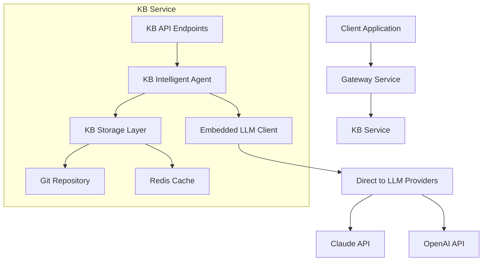

# KB Agent Implementation Proposal

**Date**: January 2025
**Author**: Gaia-Agent
**Status**: Proposed
**Context**: Embedding intelligent LLM agents within the KB service for knowledge interpretation

## Executive Summary

This proposal outlines the architecture for embedding an intelligent LLM agent directly within the KB service. The agent will interpret markdown files as rules, instructions, and knowledge that can be dynamically executed to make decisions and generate responses.

## Background

The current KB service provides file storage and search capabilities. By adding an embedded LLM agent, we can transform static knowledge into an intelligent, decision-making system that interprets markdown documentation as executable rules.

## Architecture Overview



## LLM Integration Architecture

### Architectural Decision: Direct LLM Integration

The KB service will have **its own embedded LLM client**, directly importing the shared LLM modules from `app/services/llm/`. This approach was chosen over making HTTP calls to the chat service for the following reasons:

#### Chosen Approach: Direct Integration
- **Implementation**: KB imports `MultiProviderChatService` directly
- **API Keys**: Uses same environment variables as chat service
- **Network**: Direct connections to Claude/OpenAI APIs

#### Benefits of This Approach
1. **Performance**: No inter-service network latency (saves 10-50ms per request)
2. **Reliability**: KB agent continues working even if chat service is down
3. **Flexibility**: Can optimize LLM parameters specifically for KB use cases (e.g., lower temperature for rule validation)
4. **Simplicity**: No additional authentication or service discovery needed

#### Trade-offs Considered
- **Code Sharing**: We're importing shared modules, not duplicating code
- **API Costs**: Both services maintain their own connection pools, but this enables independent scaling
- **Configuration**: Must ensure both services have LLM API keys in their environment

#### Alternative Approaches Considered
1. **HTTP to Chat Service**: Rejected due to latency concerns for real-time game decisions
2. **Shared Library**: Deferred to future refactoring after proving the architecture

## Core Components

### 1. KB Intelligent Agent (`app/services/kb/kb_agent.py`)

```python
from typing import Dict, Any, List, Optional
from app.services.llm.chat_service import MultiProviderChatService
from app.services.llm.base import ModelCapability, LLMProvider
import logging

logger = logging.getLogger(__name__)

class KBIntelligentAgent:
    """
    Embedded agent that interprets KB content as knowledge and rules.

    Key capabilities:
    - Interpret markdown as decision rules
    - Execute knowledge-driven workflows
    - Synthesize information across domains
    - Maintain context across queries
    """

    def __init__(self):
        self.llm_service = None  # Lazy init
        self.kb_storage = None   # Injected from main
        self.rule_cache: Dict[str, Any] = {}
        self.context_cache: Dict[str, List[str]] = {}

    async def initialize(self, kb_storage):
        """Initialize the agent with dependencies"""
        self.kb_storage = kb_storage
        self.llm_service = MultiProviderChatService()
        await self.llm_service.initialize()
        logger.info("KB Intelligent Agent initialized")

    async def interpret_knowledge(
        self,
        query: str,
        context_path: str,
        user_id: str,
        mode: str = "decision",  # decision, synthesis, validation
        model_hint: Optional[str] = None
    ) -> Dict[str, Any]:
        """
        Interpret knowledge from KB and generate intelligent response.

        Args:
            query: User query or decision request
            context_path: Path in KB to search for relevant knowledge
            user_id: User identifier for context
            mode: Interpretation mode
            model_hint: Preferred model to use

        Returns:
            Response with interpretation, decision, or synthesis
        """

        # 1. Load relevant knowledge from KB
        knowledge_files = await self._load_context(context_path)

        # 2. Build prompt based on mode
        if mode == "decision":
            prompt = self._build_decision_prompt(query, knowledge_files)
            required_capabilities = [ModelCapability.CHAT]
        elif mode == "synthesis":
            prompt = self._build_synthesis_prompt(query, knowledge_files)
            required_capabilities = [ModelCapability.LONG_CONTEXT]
        elif mode == "validation":
            prompt = self._build_validation_prompt(query, knowledge_files)
            required_capabilities = [ModelCapability.CODE_GENERATION]
        else:
            raise ValueError(f"Unknown mode: {mode}")

        # 3. Select appropriate model based on complexity
        model = model_hint or self._select_model_for_query(query, mode)

        # 4. Get LLM response
        response = await self.llm_service.chat_completion(
            messages=[
                {"role": "system", "content": "You are a knowledge interpreter for the Gaia platform."},
                {"role": "user", "content": prompt}
            ],
            model=model,
            user_id=user_id,
            required_capabilities=required_capabilities,
            temperature=0.3 if mode == "validation" else 0.7
        )

        # 5. Cache successful interpretations
        cache_key = f"{context_path}:{query[:50]}"
        self.rule_cache[cache_key] = {
            "response": response["response"],
            "model": response["model"],
            "timestamp": time.time()
        }

        return {
            "interpretation": response["response"],
            "model_used": response["model"],
            "context_files": len(knowledge_files),
            "mode": mode,
            "cached": False
        }

    async def execute_knowledge_workflow(
        self,
        workflow_path: str,
        parameters: Dict[str, Any],
        user_id: str
    ) -> Dict[str, Any]:
        """
        Execute a workflow defined in markdown.

        Example workflow in KB:
        ```markdown
        # Player Combat Workflow
        1. Check player stats
        2. Calculate damage based on weapon
        3. Apply environmental modifiers
        4. Update creature health
        ```
        """
        # Load workflow definition
        workflow_content = await self.kb_storage.read(workflow_path)

        # Use LLM to interpret and execute workflow steps
        prompt = f"""
        Execute this workflow with parameters {parameters}:

        {workflow_content}

        Return the result of each step and final outcome.
        """

        response = await self.llm_service.chat_completion(
            messages=[{"role": "user", "content": prompt}],
            model="claude-sonnet-4-5",  # Use powerful model for workflows
            user_id=user_id
        )

        return {
            "workflow": workflow_path,
            "parameters": parameters,
            "execution_result": response["response"],
            "model_used": response["model"]
        }

    async def validate_against_rules(
        self,
        action: str,
        rules_path: str,
        context: Dict[str, Any],
        user_id: str
    ) -> Dict[str, Any]:
        """
        Validate an action against rules defined in KB.
        """
        # Load rules
        rules = await self._load_context(rules_path)

        prompt = f"""
        Validate this action against the rules:

        Action: {action}
        Context: {context}

        Rules:
        {chr(10).join(rules.values())}

        Return: valid/invalid and explanation
        """

        response = await self.llm_service.chat_completion(
            messages=[{"role": "user", "content": prompt}],
            model="claude-3-5-haiku-20241022",  # Fast model for validation
            user_id=user_id,
            temperature=0.1  # Low temperature for consistency
        )

        return {
            "action": action,
            "validation_result": response["response"],
            "rules_checked": len(rules),
            "model_used": response["model"]
        }

    async def _load_context(self, path: str) -> Dict[str, str]:
        """Load relevant files from KB for context"""
        # Check cache first
        if path in self.context_cache:
            cache_age = time.time() - self.context_cache[path]["timestamp"]
            if cache_age < 300:  # 5 minute cache
                return self.context_cache[path]["files"]

        # Search for relevant files
        search_result = await self.kb_storage.search(f"{path}/**/*.md")

        files = {}
        for file_path in search_result.get("files", [])[:10]:  # Limit to 10 files
            content = await self.kb_storage.read(file_path)
            files[file_path] = content

        # Update cache
        self.context_cache[path] = {
            "files": files,
            "timestamp": time.time()
        }

        return files

    def _select_model_for_query(self, query: str, mode: str) -> str:
        """Select appropriate model based on query complexity"""
        query_length = len(query)

        # Simple heuristic for model selection
        if mode == "validation" or query_length < 100:
            return "claude-3-5-haiku-20241022"  # Fast
        elif mode == "synthesis" or query_length > 500:
            return "claude-sonnet-4-5"  # Powerful
        else:
            return "gpt-4-turbo-preview"  # Balanced

    def _build_decision_prompt(self, query: str, files: Dict[str, str]) -> str:
        """Build prompt for decision-making mode"""
        return f"""
        Based on the following knowledge base entries, make a decision about: {query}

        Knowledge Base:
        {self._format_files(files)}

        Provide a clear decision with reasoning based on the knowledge provided.
        """

    def _build_synthesis_prompt(self, query: str, files: Dict[str, str]) -> str:
        """Build prompt for synthesis mode"""
        return f"""
        Synthesize information from these knowledge base entries to answer: {query}

        Knowledge Base:
        {self._format_files(files)}

        Create a comprehensive synthesis that connects information across all provided sources.
        """

    def _build_validation_prompt(self, query: str, files: Dict[str, str]) -> str:
        """Build prompt for validation mode"""
        return f"""
        Validate the following against the rules and constraints in the knowledge base: {query}

        Knowledge Base:
        {self._format_files(files)}

        Return whether this is valid or invalid, with specific rule citations.
        """

    def _format_files(self, files: Dict[str, str]) -> str:
        """Format files for prompt inclusion"""
        formatted = []
        for path, content in files.items():
            # Truncate very long files
            if len(content) > 2000:
                content = content[:2000] + "\n... (truncated)"
            formatted.append(f"=== {path} ===\n{content}\n")
        return "\n".join(formatted)

# Global instance
kb_agent = KBIntelligentAgent()
```

### 2. API Endpoints (`app/services/kb/agent_endpoints.py`)

```python
from fastapi import APIRouter, Depends, HTTPException
from typing import Dict, Any, Optional
from pydantic import BaseModel
from app.shared.security import get_current_auth_unified
from .kb_agent import kb_agent

router = APIRouter(prefix="/agent", tags=["KB Agent"])

class AgentQueryRequest(BaseModel):
    query: str
    context_path: str = "/"
    mode: str = "decision"  # decision, synthesis, validation
    model_hint: Optional[str] = None

class WorkflowExecutionRequest(BaseModel):
    workflow_path: str
    parameters: Dict[str, Any]

class ValidationRequest(BaseModel):
    action: str
    rules_path: str
    context: Dict[str, Any]

@router.post("/interpret")
async def interpret_knowledge(
    request: AgentQueryRequest,
    auth: dict = Depends(get_current_auth_unified)
) -> Dict[str, Any]:
    """
    Interpret knowledge from KB to answer queries or make decisions.

    Examples:
    - Decision: "Should the player take damage from fire in the rain?"
    - Synthesis: "How do magic and combat systems interact?"
    - Validation: "Can a level 5 player cast this spell?"
    """
    user_id = auth.get("user_id") or auth.get("key")

    return await kb_agent.interpret_knowledge(
        query=request.query,
        context_path=request.context_path,
        user_id=user_id,
        mode=request.mode,
        model_hint=request.model_hint
    )

@router.post("/execute-workflow")
async def execute_workflow(
    request: WorkflowExecutionRequest,
    auth: dict = Depends(get_current_auth_unified)
) -> Dict[str, Any]:
    """
    Execute a workflow defined in KB markdown files.
    """
    user_id = auth.get("user_id") or auth.get("key")

    return await kb_agent.execute_knowledge_workflow(
        workflow_path=request.workflow_path,
        parameters=request.parameters,
        user_id=user_id
    )

@router.post("/validate")
async def validate_action(
    request: ValidationRequest,
    auth: dict = Depends(get_current_auth_unified)
) -> Dict[str, Any]:
    """
    Validate an action against rules in the KB.
    """
    user_id = auth.get("user_id") or auth.get("key")

    return await kb_agent.validate_against_rules(
        action=request.action,
        rules_path=request.rules_path,
        context=request.context,
        user_id=user_id
    )

@router.get("/agent/status")
async def agent_status() -> Dict[str, Any]:
    """Get agent status and cached rules."""
    return {
        "initialized": kb_agent.llm_service is not None,
        "cached_rules": len(kb_agent.rule_cache),
        "cached_contexts": len(kb_agent.context_cache),
        "available_models": [
            "claude-3-5-haiku-20241022",
            "claude-sonnet-4-5",
            "gpt-4-turbo-preview"
        ]
    }
```

### 3. Integration with Main KB Service

```python
# In app/services/kb/main.py, add:

from .agent_endpoints import router as agent_router
from .kb_agent import kb_agent

# In lifespan function, after KB initialization:
await kb_agent.initialize(kb_storage)
logger.info("KB Agent initialized and ready")

# Add router
app.include_router(agent_router, dependencies=[Depends(get_current_auth_unified)])
```

## Use Cases

### 1. Game Engine Rules (Wylding Woods)

```markdown
# /wylding-woods/rules/combat.md
## Fire Damage Rules
- Base fire damage: 10 HP
- Wooden creatures: Take 2x damage from fire
- Rain modifier: Reduces fire damage by 50%
- Water shield: Blocks 75% of fire damage

# /wylding-woods/rules/magic.md
## Spell Casting Requirements
- Level 1-5: Can cast basic spells
- Level 6-10: Can cast intermediate spells
- Level 11+: Can cast advanced spells
- Mana cost: Spell level * 10
```

Client request:
```json
POST /agent/interpret
{
  "query": "Player (level 5) casts fireball at wooden creature in rain. Calculate damage.",
  "context_path": "/wylding-woods/rules",
  "mode": "decision"
}
```

Agent response:
```json
{
  "interpretation": "The wooden creature takes 10 HP fire damage. Calculation: Base 10 HP * 2 (wooden) * 0.5 (rain) = 10 HP total damage.",
  "model_used": "claude-3-5-haiku-20241022",
  "context_files": 2,
  "mode": "decision"
}
```

### 2. Development Workflow Automation

```markdown
# /workflows/deployment.md
## Production Deployment Workflow
1. Run all tests
2. Check code coverage (must be >80%)
3. Build Docker images
4. Tag with version number
5. Push to registry
6. Deploy to staging
7. Run smoke tests
8. Deploy to production
9. Monitor for 5 minutes
```

Execute workflow:
```json
POST /agent/execute-workflow
{
  "workflow_path": "/workflows/deployment.md",
  "parameters": {
    "version": "1.2.3",
    "environment": "production"
  }
}
```

### 3. Compliance Validation

```markdown
# /compliance/data-privacy.md
## Data Privacy Rules
- PII must be encrypted at rest
- Logs cannot contain email addresses
- User data retention: 90 days maximum
- Deletion requests: Process within 48 hours
```

Validate action:
```json
POST /agent/validate
{
  "action": "Store user email in plain text log file",
  "rules_path": "/compliance",
  "context": {
    "data_type": "email",
    "storage_location": "logs"
  }
}
```

Response:
```json
{
  "validation_result": "INVALID: Storing email addresses in log files violates data privacy rule that states 'Logs cannot contain email addresses'",
  "rules_checked": 1,
  "model_used": "claude-3-5-haiku-20241022"
}
```

## Environment Configuration

### Required Environment Variables

The KB service needs the same LLM API keys as the chat service:

```bash
# In .env or Docker environment
OPENAI_API_KEY=sk-proj-...
ANTHROPIC_API_KEY=sk-ant-api03-...

# Optional: Model preferences
DEFAULT_LLM_MODEL=claude-3-5-haiku-20241022
DEFAULT_LLM_PROVIDER=claude
ENABLE_AUTO_MODEL_SELECTION=true
```

### Docker Compose Configuration

```yaml
kb-service:
  environment:
    - OPENAI_API_KEY=${OPENAI_API_KEY}
    - ANTHROPIC_API_KEY=${ANTHROPIC_API_KEY}
    - DEFAULT_LLM_MODEL=${DEFAULT_LLM_MODEL:-claude-3-5-haiku-20241022}
    # Existing KB configuration
    - KB_PATH=/kb
    - KB_MCP_ENABLED=true
```

This ensures the KB service can make direct LLM API calls without depending on the chat service.

## Implementation Phases

### Phase 1: Core Agent (Week 1)
- [ ] Implement `KBIntelligentAgent` class
- [ ] Add basic `/agent/interpret` endpoint
- [ ] Integrate with existing LLM service (direct import)
- [ ] Add caching layer

### Phase 2: Advanced Features (Week 2)
- [ ] Workflow execution capability
- [ ] Rule validation system
- [ ] Context management
- [ ] Multi-file synthesis

### Phase 3: Optimizations (Week 3)
- [ ] Model selection intelligence
- [ ] Response caching
- [ ] Batch processing
- [ ] Performance monitoring

### Phase 4: Game Engine Integration (Week 4)
- [ ] Wylding Woods rule system
- [ ] Real-time decision making
- [ ] Client SDK integration
- [ ] Performance optimization for gaming

## Performance Considerations

1. **Caching Strategy**
   - Cache interpreted rules for 5 minutes
   - Cache file contents in Redis
   - Pre-warm common queries

2. **Model Selection**
   - Haiku for simple validations (<100ms)
   - Sonnet for complex synthesis
   - GPT-4 for balanced performance

3. **Concurrency**
   - Use asyncio for parallel file loading
   - Connection pooling for LLM requests
   - Rate limiting per user

## Security Considerations

1. **Access Control**
   - Respect KB RBAC permissions
   - User isolation for queries
   - Audit trail for decisions

2. **Prompt Injection Prevention**
   - Sanitize user queries
   - Limit file inclusion
   - Validate context paths

3. **Resource Limits**
   - Max 10 files per query
   - 2000 chars per file
   - Rate limiting per user

## Monitoring and Observability

```python
# Metrics to track
- agent_requests_total
- agent_response_time_ms
- agent_cache_hit_rate
- agent_model_usage
- agent_error_rate
```

## Migration Path

1. **Current State**: KB provides file storage and search
2. **With Agent**: KB interprets knowledge and makes decisions
3. **Future**: Autonomous agents that update knowledge based on outcomes

## Conclusion

This architecture transforms the KB from a passive storage system into an active, intelligent knowledge interpreter. By leveraging our existing LLM infrastructure, we can deliver this capability without external dependencies while maintaining sub-second response times for most queries.

The system is designed to be:
- **Modular**: Can be enabled/disabled via configuration
- **Scalable**: Caching and model selection optimize performance
- **Extensible**: New modes and capabilities can be added easily
- **Secure**: Respects existing RBAC and adds validation layers

## Next Steps

1. Review and approve architecture
2. Create feature branch `feature/kb-agent`
3. Implement Phase 1 core functionality
4. Deploy to development environment for testing
5. Gather feedback and iterate