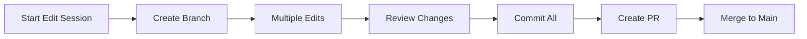

# KB Content Editing Strategy

## Overview
Strategy for safely editing Knowledge Base content while maintaining version control, security, and data integrity.

## Architecture Options

### Option 1: Direct Git Integration (Recommended)
Edit files and commit changes directly through the KB service.

**Pros:**
- Full version control
- Atomic commits
- Conflict resolution
- Audit trail

**Cons:**
- Requires Git credentials
- More complex implementation

### Option 2: Staging Directory
Write changes to a staging area, then sync to Git.

**Pros:**
- Simpler implementation
- Can batch changes
- Preview before commit

**Cons:**
- Potential sync conflicts
- Two-phase process

### Option 3: External Editor Integration
Use external tools (VSCode, Obsidian) and sync changes.

**Pros:**
- Rich editing experience
- Familiar tools
- Plugin ecosystem

**Cons:**
- Out-of-band changes
- Sync complexity

## Recommended Implementation: Git-Integrated Editing

### 1. Edit Authorization
```python
# Only specific users can edit
KB_EDITORS = ["admin@aeonia.com", "content@aeonia.com"]
KB_REVIEWERS = ["lead@aeonia.com"]

# Role-based permissions
PERMISSIONS = {
    "admin": ["read", "write", "delete", "commit"],
    "editor": ["read", "write", "commit"],
    "reviewer": ["read", "approve"],
    "viewer": ["read"]
}
```

### 2. Edit Workflow

#### Single File Edit


#### Batch Edits


### 3. API Endpoints

#### Write/Update File
```python
POST /api/v1/kb/write
{
    "path": "mmoirl/design/new-concept.md",
    "content": "# New Concept\n\nContent here...",
    "message": "Add new design concept",
    "author": {
        "name": "John Doe",
        "email": "john@aeonia.com"
    }
}
```

#### Update Existing File
```python
PUT /api/v1/kb/update
{
    "path": "gaia/specs/feature.md",
    "content": "Updated content...",
    "message": "Update feature specification",
    "create_backup": true
}
```

#### Delete File
```python
DELETE /api/v1/kb/delete
{
    "path": "obsolete/old-doc.md",
    "message": "Remove obsolete documentation"
}
```

#### Batch Operations
```python
POST /api/v1/kb/batch
{
    "operations": [
        {
            "action": "update",
            "path": "file1.md",
            "content": "..."
        },
        {
            "action": "create",
            "path": "file2.md",
            "content": "..."
        },
        {
            "action": "delete",
            "path": "file3.md"
        }
    ],
    "message": "Batch update for project X",
    "branch": "feature/project-x"
}
```

### 4. Content Validation

#### Pre-commit Checks
- Frontmatter validation
- Link integrity
- Syntax validation
- File naming conventions
- Size limits

#### Example Validator
```python
class KBContentValidator:
    def validate_frontmatter(self, content: str) -> bool:
        """Ensure required frontmatter fields"""
        required = ["title", "tags", "created", "updated"]
        # ... validation logic
    
    def validate_links(self, content: str) -> List[str]:
        """Check all [[wiki-links]] are valid"""
        # ... link checking
    
    def validate_structure(self, path: str, content: str) -> bool:
        """Ensure content follows KB conventions"""
        # ... structure validation
```

### 5. Git Integration

#### Configuration
```python
GIT_CONFIG = {
    "user.name": "KB Service",
    "user.email": "kb-service@aeonia.com",
    "push.default": "simple"
}
```

#### Commit Strategy
```python
async def commit_changes(
    file_path: str,
    content: str,
    message: str,
    author: Dict[str, str]
) -> str:
    """Commit single file change"""
    # 1. Write file
    await write_file(file_path, content)
    
    # 2. Git add
    await git_add(file_path)
    
    # 3. Commit with author
    commit_id = await git_commit(
        message=message,
        author=f"{author['name']} <{author['email']}>"
    )
    
    # 4. Push to remote
    await git_push()
    
    # 5. Invalidate cache
    await kb_cache.invalidate_pattern(f"*{file_path}*")
    
    return commit_id
```

### 6. Conflict Resolution

#### Auto-merge Strategy
- Non-conflicting changes: Auto-merge
- Conflicting changes: Create branch
- Binary files: Last-write-wins

#### Manual Resolution
```python
GET /api/v1/kb/conflicts
{
    "conflicts": [
        {
            "path": "file.md",
            "local_version": "...",
            "remote_version": "...",
            "base_version": "..."
        }
    ]
}

POST /api/v1/kb/resolve
{
    "path": "file.md",
    "resolution": "local|remote|manual",
    "content": "..." // if manual
}
```

### 7. Audit Logging

#### Edit Events
```python
class KBEditEvent:
    timestamp: datetime
    user_id: str
    action: str  # create, update, delete
    path: str
    commit_id: str
    message: str
    ip_address: str
    user_agent: str
```

#### Audit Storage
- Store in PostgreSQL audit table
- Include in Git commit messages
- Send to monitoring system

### 8. Security Measures

#### Access Control
- JWT-based authentication
- Role-based permissions
- IP allowlisting for editors
- Rate limiting on writes

#### Content Security
- Sanitize file paths
- Prevent directory traversal
- Scan for malicious content
- Backup before changes

#### Example Security Check
```python
def validate_path_security(path: str) -> bool:
    """Ensure path is safe"""
    # No parent directory access
    if ".." in path:
        return False
    
    # Must be within KB root
    if not path.startswith(allowed_prefixes):
        return False
    
    # No hidden files
    if any(part.startswith('.') for part in path.split('/')):
        return False
    
    return True
```

### 9. Implementation Phases

#### Phase 1: Basic Editing
- Single file create/update/delete
- Direct Git commits
- Basic validation

#### Phase 2: Advanced Features
- Batch operations
- Branch management
- Conflict resolution

#### Phase 3: Collaboration
- Real-time collaboration
- Change proposals
- Review workflows

### 10. Deployment Considerations

#### Development
- Mount KB as read-write
- Use local Git repo
- Relaxed permissions

#### Production
- Restricted write access
- Git SSH keys
- Full audit logging
- Automated backups

## Alternative: CMS-Style Editing

For a more user-friendly approach, consider a CMS layer:

### Database-Backed Drafts
```sql
CREATE TABLE kb_drafts (
    id UUID PRIMARY KEY,
    path VARCHAR(500),
    content TEXT,
    author_id UUID,
    created_at TIMESTAMP,
    updated_at TIMESTAMP,
    status VARCHAR(50), -- draft, review, approved
    publish_at TIMESTAMP
);
```

### Publishing Pipeline
1. Create/edit in database
2. Review and approve
3. Publish to Git
4. Sync to KB filesystem

### Benefits
- WYSIWYG editing possible
- Scheduling and workflows
- Rollback capability
- Preview before publish

## Recommendations

1. **Start Simple**: Implement basic single-file editing with Git
2. **Add Validation**: Ensure content quality and security
3. **Enable Batching**: Support multiple file operations
4. **Consider CMS**: For non-technical users
5. **Monitor Usage**: Track edits and performance
6. **Regular Backups**: Before and after edit sessions