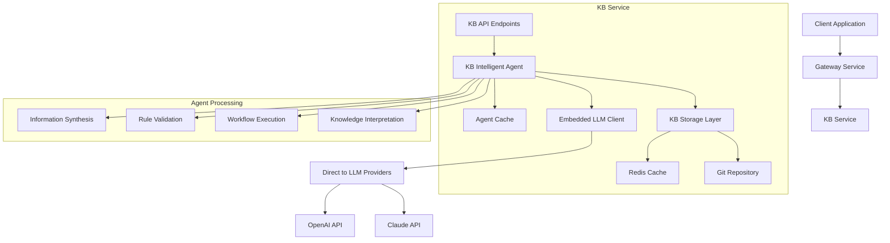

# KB Agent Architecture

**Date**: September 2025
**Status**: Production Implementation
**Version**: 1.0.0

## Architectural Overview

The KB Agent represents a paradigm shift from passive knowledge storage to **active knowledge interpretation**. By embedding an intelligent LLM agent directly within the KB service, we transform static markdown content into executable knowledge that can make decisions, validate actions, and execute complex workflows.



## Core Components

### 1. KB Intelligent Agent (`kb_agent.py`)

The central intelligence component that orchestrates all knowledge interpretation activities.

#### Key Responsibilities:
- **Knowledge Loading**: Retrieves relevant KB content based on context paths
- **Model Selection**: Chooses appropriate LLM models based on task complexity
- **Prompt Engineering**: Constructs specialized prompts for different operation modes
- **Response Processing**: Formats and caches LLM responses
- **Error Handling**: Graceful degradation and error recovery

#### Class Structure:
```python
class KBIntelligentAgent:
    def __init__(self):
        self.llm_service = None       # MultiProviderChatService instance
        self.kb_storage = None        # KB storage backend
        self.rule_cache = {}          # Performance cache
        self.context_cache = {}       # Context loading cache

    async def interpret_knowledge(...)   # Core interpretation logic
    async def execute_knowledge_workflow(...)  # Workflow execution
    async def validate_against_rules(...)     # Rule validation
```

#### Design Patterns:
- **Dependency Injection**: KB storage injected during initialization
- **Lazy Loading**: LLM service initialized only when needed
- **Cache-Aside**: Rule interpretations cached for performance
- **Strategy Pattern**: Different prompt strategies for different modes

### 2. Agent Endpoints (`agent_endpoints.py`)

RESTful API layer that exposes agent functionality as HTTP endpoints.

#### Endpoint Architecture:
```python
router = APIRouter(prefix="/agent", tags=["KB Agent"])

# Core endpoints
@router.post("/interpret")    # Knowledge interpretation
@router.post("/workflow")     # Workflow execution
@router.post("/validate")     # Rule validation
@router.get("/status")        # Agent health/capabilities
@router.post("/cache/clear")  # Cache management
```

#### Request/Response Patterns:
- **Consistent Input**: All endpoints use structured Pydantic models
- **Unified Output**: Standard response format with status, result, metadata
- **Error Handling**: Comprehensive exception handling with informative errors
- **Authentication**: Consistent API key validation across all endpoints

### 3. Service Integration (`main.py`)

Lifecycle management and service integration within the KB service.

#### Integration Points:
```python
# Dependency injection during startup
await kb_agent.initialize(kb_storage)

# Router registration
app.include_router(agent_router)

# Shared authentication
from app.shared.security import get_current_auth_legacy
```

#### Startup Sequence:
1. **KB Storage Initialization**: Storage backend ready
2. **Agent Initialization**: LLM service connection established
3. **Router Registration**: API endpoints exposed
4. **Health Verification**: Agent status confirmed

## LLM Integration Architecture

### Direct Integration Approach

The KB Agent uses **direct LLM integration** rather than HTTP calls to the chat service.

#### Benefits:
- **Performance**: Eliminates 10-50ms inter-service latency
- **Reliability**: Independent operation if chat service unavailable
- **Optimization**: Model selection optimized for KB-specific use cases
- **Simplicity**: No additional authentication or service discovery

#### Implementation:
```python
from app.services.llm.chat_service import MultiProviderChatService

class KBIntelligentAgent:
    async def initialize(self, kb_storage):
        self.llm_service = MultiProviderChatService()
        await self.llm_service.initialize()
```

### Model Selection Strategy

Intelligent model selection based on operation requirements:

| Operation Type | Model Choice | Rationale |
|---------------|--------------|-----------|
| **Validation** | claude-3-5-haiku-20241022 | Fast, consistent, cost-effective |
| **Simple Decisions** | claude-3-5-haiku-20241022 | Adequate capability, fast response |
| **Complex Synthesis** | claude-sonnet-4-5 | Superior reasoning for complex tasks |
| **Workflow Execution** | claude-sonnet-4-5 | Multi-step reasoning capability |

### Temperature Configuration

Context-appropriate temperature settings:

- **Validation Mode**: 0.1 (maximum consistency)
- **Decision Mode**: 0.7 (balanced creativity/consistency)
- **Synthesis Mode**: 0.7 (creative connections)
- **Workflow Mode**: 0.3 (structured execution)

## Knowledge Loading Architecture

### Universal Context Path Resolution

The agent loads knowledge using a universal approach that supports both indexed and non-indexed KB structures:

```python
async def _load_context(self, context_path: str) -> Dict[str, str]:
    # Use list_kb_directory to find all markdown files
    list_result = await kb_server.list_kb_directory(
        path=context_path,
        pattern="*.md"
    )

    files = {}
    if list_result.get("success"):
        # Load content from discovered files
        for file_info in list_result.get("files", []):
            file_path = file_info["path"]
            file_result = await kb_server.read_kb_file(file_path)
            if file_result.get("success"):
                files[file_path] = file_result["content"]

        # Recursively process subdirectories
        for dir_info in list_result.get("directories", []):
            subdir_files = await self._load_context(dir_info["path"])
            files.update(subdir_files)

    return files
```

### Knowledge Integration Patterns

#### Universal File Discovery
- **Direct File Access**: Uses `list_kb_directory` to find all markdown files
- **Index-Agnostic**: Works with both `+index.md` files and regular `.md` files
- **Recursive Collection**: Automatically traverses subdirectories
- **Pattern Matching**: Finds files using glob patterns (`*.md`)

#### Hybrid Structure Support
- **Legacy Index Files**: Supports existing `+*.md` index-based directories
- **Simple File Collections**: Works with directories containing only regular `.md` files
- **Mixed Structures**: Handles directories with both indexed and non-indexed content
- **Backward Compatibility**: 100% compatible with existing KB structures

#### Content Processing
- **Markdown Native**: Direct interpretation of markdown content
- **Frontmatter Support**: Processes YAML frontmatter metadata
- **Link Resolution**: Follows internal KB references
- **Content Validation**: Ensures file accessibility before loading

## Operation Modes

### Decision Mode

**Purpose**: Make decisions based on available knowledge

```python
def _build_decision_prompt(self, query: str, knowledge_files: Dict[str, str]) -> str:
    return f"""
    Based on the following knowledge base content, make a decision or provide guidance:

    **Query:** {query}
    **Available Knowledge:** {knowledge_text}

    Please provide a clear decision or recommendation.
    """
```

**Use Cases**:
- Game master decisions
- Policy interpretations
- Architectural choices

### Synthesis Mode

**Purpose**: Combine information from multiple knowledge sources

```python
def _build_synthesis_prompt(self, query: str, knowledge_files: Dict[str, str]) -> str:
    return f"""
    Synthesize information from multiple knowledge sources:

    **Query:** {query}
    **Knowledge Sources:** {knowledge_text}

    Please synthesize insights from across these sources.
    """
```

**Use Cases**:
- Cross-domain analysis
- Comprehensive overviews
- Knowledge gap identification

### Validation Mode

**Purpose**: Validate actions against established rules

```python
def _build_validation_prompt(self, query: str, knowledge_files: Dict[str, str]) -> str:
    return f"""
    Validate this query against the established rules:

    **Query to Validate:** {query}
    **Rules and Guidelines:** {knowledge_text}

    Please return "VALID" or "INVALID" followed by explanation.
    """
```

**Use Cases**:
- Rule enforcement
- Compliance checking
- Action authorization

## Workflow Execution Architecture

### Workflow Definition Format

Workflows are defined in structured markdown:

```markdown
# Workflow Name
Brief description

## Steps:
1. First step description
2. Second step description
3. Final step description

## Parameters:
- param1: Description
- param2: Description

## Expected Output:
What the workflow produces
```

### Execution Process

1. **Workflow Loading**: Retrieve markdown definition from KB
2. **Parameter Injection**: Merge provided parameters with workflow
3. **LLM Interpretation**: Use powerful model for step-by-step execution
4. **Result Formatting**: Structure execution results for consumption

```python
async def execute_knowledge_workflow(self, workflow_path: str, parameters: Dict[str, Any], user_id: str):
    # Load workflow definition
    workflow_content = await kb_server.read_kb_file(workflow_path)

    # Build execution prompt
    prompt = f"""
    Execute this workflow with parameters {parameters}:
    {workflow_content["content"]}
    Return the result of each step and final outcome.
    """

    # Execute with powerful model
    response = await self.llm_service.chat_completion(
        messages=[{"role": "user", "content": prompt}],
        model="claude-sonnet-4-5",
        user_id=user_id
    )
```

## Caching Architecture

### Rule Cache Design

Performance optimization through intelligent caching:

```python
# Cache successful interpretations
cache_key = f"{context_path}:{query[:50]}"
self.rule_cache[cache_key] = {
    "response": response["response"],
    "model": response["model"],
    "timestamp": time.time()
}
```

#### Cache Characteristics:
- **Key Strategy**: Context path + query prefix
- **TTL**: Session-based (cleared on restart)
- **Eviction**: Manual clearing via API endpoint
- **Hit Rate**: Optimized for repeated rule queries

### Context Cache

Optimizes knowledge loading for repeated context paths:

```python
self.context_cache: Dict[str, List[str]] = {}
```

## Security Architecture

### Authentication Integration

Seamless integration with existing KB service authentication:

```python
from app.shared.security import get_current_auth_legacy

@router.post("/interpret")
async def interpret_knowledge(
    request: AgentQueryRequest,
    auth: dict = Depends(get_current_auth)
):
    user_id = auth.get("email", auth.get("user_id", "unknown"))
```

### Authorization Patterns

- **API Key Validation**: Consistent with other KB endpoints
- **User Identification**: Email-based user tracking
- **Request Logging**: Comprehensive audit trail
- **Error Sanitization**: Secure error message handling

## Performance Architecture

### Response Time Optimization

Target response times by operation:

- **Status Check**: < 100ms
- **Validation**: 500-1000ms
- **Decision**: 1-2 seconds
- **Synthesis**: 2-4 seconds
- **Workflow**: 3-5 seconds

### Scalability Considerations

#### Horizontal Scaling
- **Stateless Design**: No shared state between requests
- **Connection Pooling**: Efficient LLM API connection management
- **Cache Distribution**: Redis-based cache sharing (future)

#### Vertical Scaling
- **Memory Management**: Efficient context loading and caching
- **CPU Optimization**: Minimal processing overhead
- **I/O Efficiency**: Concurrent KB file loading

### Monitoring and Observability

#### Key Metrics
- **Request Latency**: Per-operation response times
- **Cache Hit Rate**: Rule cache effectiveness
- **Model Usage**: Cost and performance tracking
- **Error Rate**: Failed request monitoring

#### Logging Strategy
```python
logger.info(f"KB agent interpretation for user {user_id}: mode={mode}, files={context_files}")
logger.error(f"KB agent validation failed: {e}", exc_info=True)
```

## Integration Patterns

### Chat Service Relationship

**Complementary Architecture**: KB Agent and Chat Service work together:

- **Chat Service**: General conversation, user interactions
- **KB Agent**: Specialized knowledge interpretation, rule enforcement
- **Handoff Pattern**: Chat can delegate to KB Agent for knowledge-specific queries

### Knowledge Base Synergy

**Live Content Access**: Direct file system integration:

- **No Sync Delays**: Always operates on latest KB content
- **Git Native**: Automatically picks up new commits
- **Markdown First**: Native markdown interpretation

### Gateway Integration

**Service Discovery**: Exposed through standard patterns:

```yaml
# Gateway routing
KB_SERVICE_URL: http://kb-service:8000

# Agent endpoints accessible via:
# /api/kb/agent/interpret
# /api/kb/agent/workflow
# /api/kb/agent/validate
```

## Future Architecture Considerations

### Extensibility Points

1. **Plugin Architecture**: Support for custom operation modes
2. **Model Registry**: Dynamic model selection and configuration
3. **Workflow Engine**: More sophisticated workflow execution
4. **Knowledge Graph**: Enhanced relationship understanding

### Performance Enhancements

1. **Distributed Caching**: Redis-based cache sharing
2. **Model Optimization**: Fine-tuned models for specific KB domains
3. **Batch Processing**: Bulk operation support
4. **Streaming Responses**: Real-time response streaming

### Security Enhancements

1. **Fine-grained Authorization**: Per-context access controls
2. **Content Filtering**: Sensitive information protection
3. **Audit Logging**: Comprehensive security audit trails
4. **Rate Limiting**: Advanced rate limiting and throttling

This architecture provides a solid foundation for intelligent knowledge interpretation while maintaining the flexibility to evolve with the platform's growing needs.