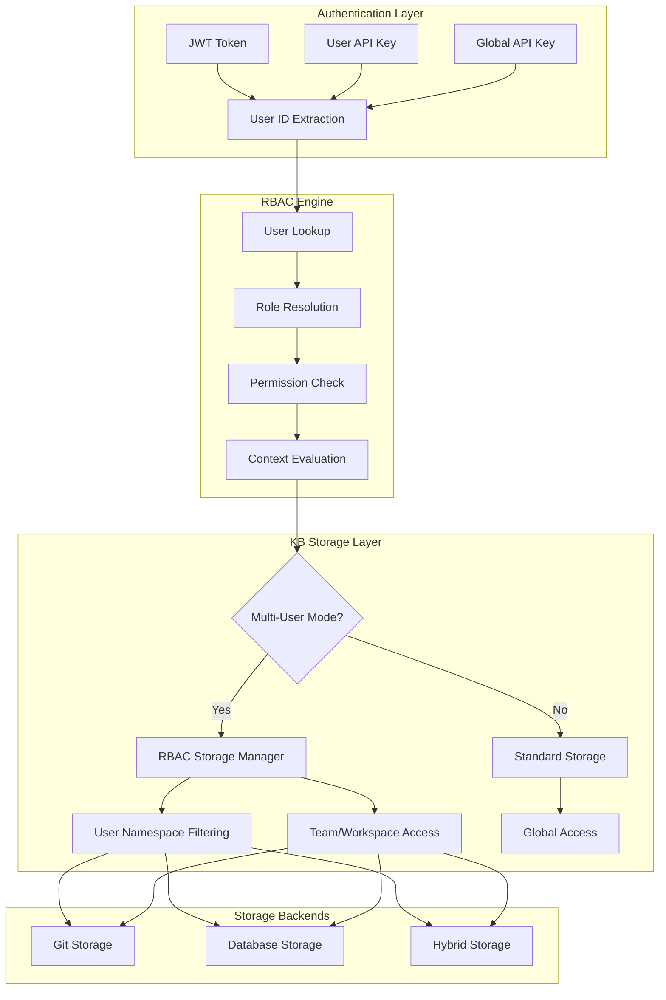

# Multi-User KB Architecture Design

## Overview

The multi-user Knowledge Base system transforms the single-user KB into a collaborative platform with role-based access control (RBAC), user isolation, and team/workspace organization.

## Architecture Components



## Database Schema

### Core RBAC Tables

```sql
-- Users (existing from LLM Platform)
users (
    id UUID PRIMARY KEY,
    email VARCHAR(255) UNIQUE,
    name VARCHAR(255),
    is_active BOOLEAN DEFAULT true
)

-- Roles define permission sets
roles (
    id UUID PRIMARY KEY,
    name VARCHAR(100) UNIQUE,           -- 'kb_admin', 'kb_editor', 'kb_viewer'
    display_name VARCHAR(255),          -- 'KB Administrator'
    description TEXT,
    role_type VARCHAR(50),              -- 'system', 'custom', 'team', 'workspace'
    is_active BOOLEAN DEFAULT true
)

-- User-Role assignments with context
user_roles (
    user_id UUID REFERENCES users(id),
    role_id UUID REFERENCES roles(id),
    context_type VARCHAR(50),           -- 'global', 'team', 'workspace'
    context_id VARCHAR(500),            -- team_id, workspace_id, or NULL
    assigned_by UUID REFERENCES users(id),
    expires_at TIMESTAMP                -- Optional expiration
)

-- Fine-grained permissions
permissions (
    id UUID PRIMARY KEY,
    resource_type VARCHAR(100),         -- 'kb', 'api', 'chat', 'asset'
    resource_path VARCHAR(500),         -- '/kb/users/*', '/kb/teams/*'
    action VARCHAR(50),                 -- 'read', 'write', 'delete', 'share'
    description TEXT
)

-- Role-Permission mapping
role_permissions (
    role_id UUID REFERENCES roles(id),
    permission_id UUID REFERENCES permissions(id)
)
```

### Organization Tables

```sql
-- Teams (permanent organizational units)
teams (
    id UUID PRIMARY KEY,
    name VARCHAR(100) UNIQUE,           -- 'engineering', 'design'
    display_name VARCHAR(255),          -- 'Engineering Team'
    description TEXT,
    parent_team_id UUID REFERENCES teams(id), -- Nested teams
    is_active BOOLEAN DEFAULT true,
    created_by UUID REFERENCES users(id)
)

-- Team membership
team_members (
    team_id UUID REFERENCES teams(id),
    user_id UUID REFERENCES users(id),
    role VARCHAR(50),                   -- 'admin', 'member', 'viewer'
    joined_at TIMESTAMP DEFAULT CURRENT_TIMESTAMP
)

-- Workspaces (temporary project groups)
workspaces (
    id UUID PRIMARY KEY,
    name VARCHAR(100) UNIQUE,           -- 'q1-planning', 'project-alpha'
    display_name VARCHAR(255),          -- 'Q1 2025 Planning'
    description TEXT,
    workspace_type VARCHAR(50),         -- 'project', 'incident', 'research'
    status VARCHAR(50),                 -- 'active', 'archived', 'completed'
    created_by UUID REFERENCES users(id),
    expires_at TIMESTAMP                -- Time-bound workspaces
)

-- Workspace membership
workspace_members (
    workspace_id UUID REFERENCES workspaces(id),
    user_id UUID REFERENCES users(id),
    joined_at TIMESTAMP DEFAULT CURRENT_TIMESTAMP
)
```

### Resource Sharing

```sql
-- Shared resources tracking
shared_resources (
    id UUID PRIMARY KEY,
    resource_type VARCHAR(100),         -- 'kb_document', 'chat_conversation'
    resource_id VARCHAR(500),           -- Document path, conversation ID
    shared_by UUID REFERENCES users(id),
    share_type VARCHAR(50),             -- 'direct', 'link', 'public'
    permissions TEXT[],                 -- ['read', 'write', 'share']
    expires_at TIMESTAMP,
    access_count INTEGER DEFAULT 0
)

-- Resource-specific permissions
resource_permissions (
    resource_type VARCHAR(100),
    resource_id VARCHAR(500),
    principal_type VARCHAR(50),         -- 'user', 'team', 'workspace'
    principal_id VARCHAR(500),          -- User ID, team ID, workspace ID
    permissions TEXT[],                 -- ['read', 'write', 'delete']
    granted_by UUID REFERENCES users(id)
)
```

## User Namespace Design

### Path Structure
```
/kb/
├── users/{user_id}/                    # User private namespaces
│   ├── private/                        # User-only access
│   ├── shared/                         # User can share from here
│   └── drafts/                         # Work-in-progress
├── teams/{team_id}/                    # Team collaboration spaces
│   ├── docs/                           # Team documentation
│   ├── projects/                       # Team projects
│   └── resources/                      # Team resources
├── workspaces/{workspace_id}/          # Project workspaces
│   ├── planning/                       # Project planning docs
│   ├── research/                       # Research materials
│   └── deliverables/                   # Project outputs
├── shared/                             # Organization-wide shared
│   ├── policies/                       # Company policies
│   ├── templates/                      # Document templates
│   └── resources/                      # General resources
└── public/                             # Public/guest accessible
    ├── documentation/                  # Public documentation
    └── announcements/                  # Public announcements
```

### Access Control Rules

| Path Pattern | Owner | Admin | Editor | Viewer |
|-------------|-------|-------|--------|--------|
| `/kb/users/{self}/` | CRUD+Share | - | - | - |
| `/kb/users/{other}/` | - | Read* | - | - |
| `/kb/teams/{member}/` | CRUD+Share | CRUD+Share | CRUD | Read |
| `/kb/teams/{non-member}/` | - | Read* | - | - |
| `/kb/workspaces/{member}/` | CRUD+Share | CRUD+Share | CRUD | Read |
| `/kb/shared/` | - | CRUD+Share | CRUD | Read |
| `/kb/public/` | - | CRUD+Share | Read | Read |

*Admin read access subject to privacy settings

## Permission Resolution Algorithm

```python
async def check_kb_access(user_id: str, path: str, action: str) -> bool:
    # 1. Extract path components
    path_parts = parse_kb_path(path)
    
    # 2. Check user's global roles
    global_roles = await get_user_roles(user_id, context_type="global")
    if has_global_permission(global_roles, action):
        return True
    
    # 3. Check path-specific access
    if path_parts.namespace == "users":
        # User namespace: owner has full access
        if path_parts.user_id == user_id:
            return True
            
    elif path_parts.namespace == "teams":
        # Team namespace: check team membership
        if await is_team_member(user_id, path_parts.team_id):
            team_role = await get_team_role(user_id, path_parts.team_id)
            return has_team_permission(team_role, action)
            
    elif path_parts.namespace == "workspaces":
        # Workspace namespace: check workspace membership
        if await is_workspace_member(user_id, path_parts.workspace_id):
            return has_workspace_permission(action)
            
    elif path_parts.namespace == "shared":
        # Shared namespace: check role-based access
        return await check_shared_access(user_id, action)
        
    elif path_parts.namespace == "public":
        # Public namespace: generally readable
        return action in ["read", "access"]
    
    # 4. Check explicit resource permissions
    return await check_resource_permissions(user_id, path, action)
```

## Role Hierarchy

### System Roles
```yaml
super_admin:
  description: "Full system access"
  permissions: ["*"]
  
admin:
  description: "Administrative access"  
  permissions: ["kb:*", "api:admin", "user:manage"]
  
developer:
  description: "Developer access to APIs"
  permissions: ["api:*", "kb:read", "kb:write"]

kb_admin:
  description: "Full KB management"
  permissions: ["kb:*"]
  
kb_editor:
  description: "Create and edit KB content"
  permissions: ["kb:read", "kb:write", "kb:share"]
  
kb_contributor:
  description: "Contribute to assigned areas"
  permissions: ["kb:read", "kb:write:assigned"]
  
kb_viewer:
  description: "Read-only KB access"
  permissions: ["kb:read"]
  
guest:
  description: "Limited guest access"
  permissions: ["kb:read:public"]
```

### Contextual Roles
```yaml
team_admin:
  context: "team"
  permissions: ["kb:*:team", "team:manage"]
  
team_member:
  context: "team" 
  permissions: ["kb:read:team", "kb:write:team"]
  
workspace_admin:
  context: "workspace"
  permissions: ["kb:*:workspace", "workspace:manage"]
  
workspace_member:
  context: "workspace"
  permissions: ["kb:read:workspace", "kb:write:workspace"]
```

## Storage Backend Integration

### Single-User Mode (Backward Compatible)
```python
# When KB_MULTI_USER_ENABLED=false
kb_storage = KBStorageManager()  # Direct file access
kb_server = KBMCPServer()        # No user context
```

### Multi-User Mode  
```python
# When KB_MULTI_USER_ENABLED=true
kb_storage = KBStorageWithRBAC()     # RBAC-wrapped storage
kb_server = KBRBACWrapper()          # User-aware operations
```

### Storage Mode Options
- **Git**: File-based with Git version control
- **Database**: PostgreSQL with full-text search
- **Hybrid**: PostgreSQL primary + Git backup (recommended)

## API Integration

### Authentication Headers
```http
# JWT Authentication (web users)
Authorization: Bearer <jwt_token>

# User API Key (programmatic access)
X-API-Key: <user_api_key>

# Service API Key (admin/service access)  
X-API-Key: <global_api_key>
```

### Request Flow
```python
@router.get("/kb/search")
async def search_kb(
    q: str,
    auth: dict = Depends(get_current_auth_legacy)
):
    user_id = auth.get("user_id")
    
    # Multi-user: filter by user permissions
    if settings.KB_MULTI_USER_ENABLED and user_id:
        results = await kb_storage_rbac.search_documents(
            query=q,
            user_id=user_id  # ← User context enforces permissions
        )
    else:
        # Single-user: global access
        results = await kb_storage.search_documents(query=q)
    
    return results
```

## Configuration

### Environment Variables
```bash
# Multi-user KB settings
KB_MULTI_USER_ENABLED=true
KB_USER_ISOLATION=strict           # 'strict' or 'permissive'
KB_DEFAULT_VISIBILITY=private      # 'private' or 'public'
KB_SHARING_ENABLED=true
KB_WORKSPACE_ENABLED=true
KB_TEAM_ENABLED=true

# RBAC settings
RBAC_CACHE_TTL=300                 # Permission cache TTL (seconds)
RBAC_AUDIT_ENABLED=true           # Enable audit logging

# Storage settings
KB_STORAGE_MODE=hybrid            # 'git', 'database', 'hybrid'
KB_PATH=/kb
KB_CACHE_TTL=300
```

### Service Integration
```python
# Services auto-detect multi-user mode
if settings.KB_MULTI_USER_ENABLED:
    # Use RBAC-enabled components
    from .kb_storage_with_rbac import KBStorageWithRBAC
    kb_storage = KBStorageWithRBAC()
else:
    # Use standard components
    from .kb_storage_manager import KBStorageManager
    kb_storage = KBStorageManager()
```

## Security Features

### User Isolation
- Private user namespaces (`/kb/users/{user_id}/`)
- Permission-based path filtering
- Encrypted storage of sensitive data

### Audit Trail
- All permission grants/revokes logged
- Resource access tracking
- User activity monitoring

### Caching & Performance
- Redis-backed permission caching (5-minute TTL)
- Efficient role resolution algorithms
- Database query optimization

### Privacy Controls
- Configurable user isolation levels
- Optional admin override capabilities
- Privacy-aware sharing mechanisms

## Migration Strategy

### Existing Single-User Deployments
1. **Zero-downtime**: Multi-user mode is opt-in
2. **Backward compatible**: All existing APIs work unchanged
3. **Gradual adoption**: Enable per-service as needed

### Data Migration
```sql
-- Convert existing users to default role
INSERT INTO user_roles (user_id, role_id, context_type, assigned_by)
SELECT id, 'kb_editor_role', 'global', 'system'
FROM users
WHERE id NOT IN (SELECT user_id FROM user_roles);
```

This architecture provides enterprise-grade multi-user capabilities while maintaining simplicity and backward compatibility.