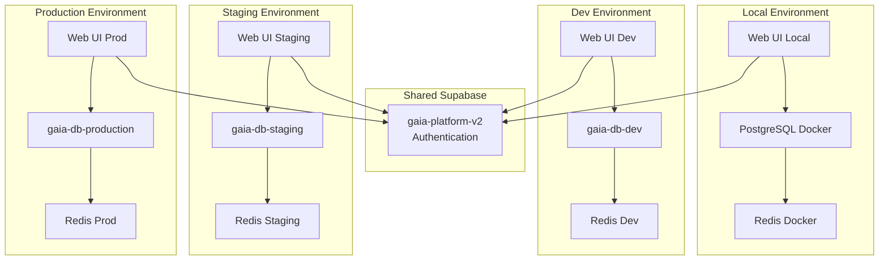

# Database Architecture


This document explains the complete database architecture for the Gaia Platform across all environments.

## Overview

The Gaia Platform uses a **simplified hybrid database architecture**:
- **PostgreSQL**: Single shared database (`llm_platform`) containing all application data for all services
- **Supabase**: Authentication only (shared across all environments) for JWT validation
- **Redis**: Caching layer (isolated per environment) to provide performance improvements
- **Certificate Storage**: Development certificates mounted as Docker volumes

**Note**: All microservices (Auth, Chat, KB, Asset, Gateway) share the same PostgreSQL database for simplicity and consistency. This represents a simplified architecture where an unused secondary database (`gaia`) was removed in October 2025 to eliminate confusion and align documentation with implementation reality.

## Database Distribution

### Application Databases (PostgreSQL)

| Environment | Database Location | Connection | Isolation |
|------------|------------------|------------|-----------|
| Local | Docker container | `db:5432/llm_platform` | Complete |
| Dev | Fly.io | `gaia-db-dev.internal:5432` | Complete |
| Staging | Fly.io | `gaia-db-staging.internal:5432` | Complete |
| Production | Fly.io | `gaia-db-production.internal:5432` | Complete |

### Authentication Database (Supabase)

| Project | Used By | Purpose |
|---------|---------|---------|
| `gaia-platform-v2` | ALL environments | User authentication |
| `aeonia-gaia` | None (unused) | Legacy project |

### Caching Layer (Redis)

| Environment | Redis Instance | Purpose |
|------------|---------------|---------|
| Local | Docker container | API key caching |
| Dev | Fly.io Redis | API key caching |
| Staging | Fly.io Redis | API key caching |
| Production | Fly.io Redis | API key caching |

## Data Flow



## What's Stored Where

### PostgreSQL (`llm_platform` database)

**Core Tables (6):**
- `users` - User profiles linked to Supabase auth
- `api_keys` - User API keys (hashed)
- `conversations` - Chat conversations
- `chat_messages` - Individual chat messages
- `personas` - AI persona configurations
- `user_persona_preferences` - User persona selections

**Asset Management (5):**
- `assets` - Generated asset metadata
- `asset_generations` - Asset generation tracking
- `asset_modifications` - Asset modification history
- `asset_sources` - Asset source information
- `asset_usage` - Asset usage analytics

**Knowledge Base (6):**
- `kb_documents` - Knowledge base document storage
- `kb_search_index` - Search index for KB
- `kb_activity_log` - KB activity tracking
- `kb_context_cache` - KB context caching
- `kb_document_history` - KB document versioning
- `kb_permissions` - KB access permissions

**Semantic Search (2):**
- `kb_semantic_chunk_ids` - ChromaDB chunk ID mappings
- `kb_semantic_index_metadata` - Semantic search index metadata

**Total: 19 tables currently deployed**

---

**Planned: RBAC System (13 tables):**

Migrations exist in `migrations/003_add_rbac_tables.sql` and `migrations/004_create_rbac_tables.sql` but have not been applied.

- `roles` - User roles definition
- `permissions` - Permission definitions
- `role_permissions` - Role-permission mappings
- `user_roles` - User-role assignments
- `user_permissions` - Direct user permissions
- `teams` - Team management
- `team_members` - Team membership
- `workspaces` - Workspace organization
- `workspace_members` - Workspace membership
- `shared_resources` - Shared resource tracking
- `resource_permissions` - Resource access control
- `resource_shares` - Resource sharing records
- `permission_audit_log` - Permission change auditing

**Planned: Experience Platform (3 tables):**

Not yet implemented.

- `player_profiles` - Player stats across all experiences
- `experience_progress` - Per-experience player progress
- `player_progress_events` - Event log for analytics

**Future total: 35 tables** (19 deployed + 13 RBAC + 3 Experience)

### Supabase (Shared)
- `auth.users` - Email, password hash, email verification
- `auth.sessions` - Active user sessions
- `auth.refresh_tokens` - Session refresh tokens
- Authentication metadata only

### Redis (Per Environment)
- API key validation cache
- Session data cache
- Temporary processing data

## Authentication Flow

1. **User Registration**
   ```
   User → Supabase (shared) → Creates auth record
         ↓
   App → PostgreSQL (llm_platform) → Creates user profile
   ```

2. **User Login**
   ```
   User → Supabase (shared) → Validates credentials
         ↓
   App → PostgreSQL (llm_platform) → Loads user data
         ↓
   Redis (environment-specific) → Caches session
   ```

## Important Limitations

### ⚠️ Shared Authentication Issues

Since all environments share one Supabase project:

1. **No Environment Isolation**
   - `test@example.com` registered in dev can log into production
   - No way to restrict users to specific environments

2. **Email Verification Confusion**
   - Verification emails show the Site URL configured in Supabase
   - Users may need to manually adjust the URL for their environment

3. **Test Data Pollution**
   - Test accounts exist alongside production accounts
   - Must use email prefixes to distinguish

## Best Practices

### 1. Email Naming Convention
```
Local:      jason+local@example.com
Dev:        jason+dev@example.com
Staging:    jason+staging@example.com
Production: jason@example.com
```

### 2. Database Queries
```bash
# View all environments
./scripts/view-databases.sh all

# Check specific environment
./scripts/view-databases.sh dev "SELECT * FROM users;"

# View Supabase auth
# Go to: https://supabase.com/dashboard/project/lbaohvnusingoztdzlmj
```

### 3. Data Cleanup
```sql
-- Remove test users from production PostgreSQL
DELETE FROM users WHERE email LIKE '%+dev@%' OR email LIKE '%+staging@%';

-- Note: Cannot remove from Supabase without affecting all environments
```

## Security Considerations

1. **API Keys**: Stored in environment-specific PostgreSQL (not shared)
2. **User Data**: Isolated per environment
3. **Authentication**: Shared across all environments (security risk)

## Migration Strategies

### Option 1: Use Second Supabase Project
- Move production to `aeonia-gaia` project
- Keep dev/staging on `gaia-platform-v2`

### Option 2: Upgrade to Supabase Pro
- $25/month per project
- Create separate projects for each environment

### Option 3: Add Metadata Tags
- Tag users with their intended environment
- Enforce at application level

## Viewing Databases

### Quick Commands
```bash
# Local PostgreSQL
docker compose exec db psql -U postgres -d llm_platform

# Dev PostgreSQL
fly postgres connect -a gaia-db-dev

# Staging PostgreSQL
fly postgres connect -a gaia-db-staging

# Production PostgreSQL
fly postgres connect -a gaia-db-production

# Supabase (web only)
# https://supabase.com/dashboard/project/lbaohvnusingoztdzlmj
```

### Using Helper Script
```bash
# View all databases
./scripts/view-databases.sh all

# View specific environment
./scripts/view-databases.sh dev
./scripts/view-databases.sh staging
./scripts/view-databases.sh production

# Run custom query
./scripts/view-databases.sh dev "SELECT email, created_at FROM users ORDER BY created_at DESC LIMIT 10;"

---

## Verification Status

**Last Verified:** 2025-12-09
**Method:** Direct database query (`\dt` on running PostgreSQL)

| Check | Status | Notes |
|-------|--------|-------|
| PostgreSQL `llm_platform` database | ✅ Verified | Single shared database for all services |
| 19 deployed tables | ✅ Verified | Queried actual database |
| Supabase integration | ✅ Verified | `gaia-platform-v2` project |
| RBAC tables | ⏳ Planned | Migrations exist, not yet applied |
| Experience Platform tables | ⏳ Planned | Not yet implemented |
