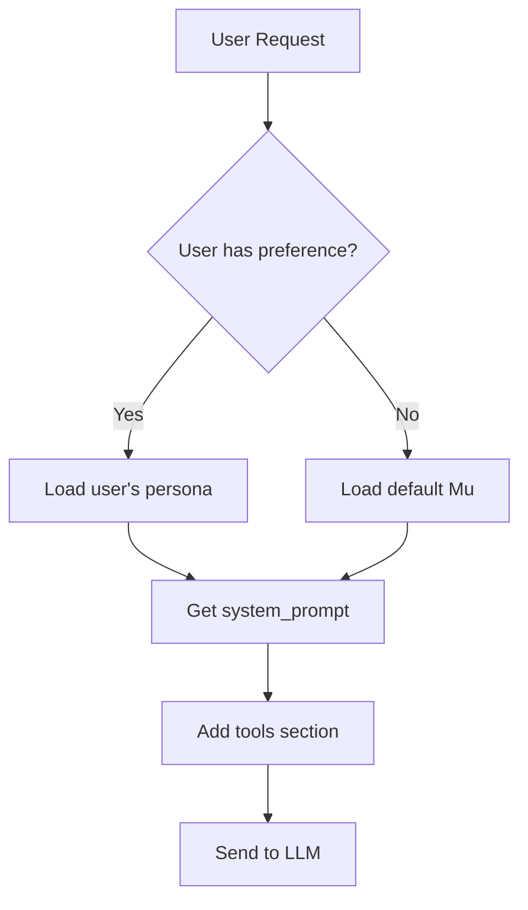

# Persona System Architecture Guide

**Status**: 🟢 Implemented  
**Last Updated**: January 2025

## Overview

The GAIA persona system provides customizable AI personalities that shape how the system interacts with users. Each persona has unique traits, capabilities, and communication styles that are dynamically injected into chat interactions.

## System Components

### 1. Database Layer

#### Tables (PostgreSQL)

**personas table**:
```sql
CREATE TABLE personas (
    id UUID PRIMARY KEY,
    name VARCHAR(100) UNIQUE,      -- e.g., "Mu"
    description TEXT,               -- Human-readable description
    system_prompt TEXT,             -- Core instructions/directives
    personality_traits JSONB,      -- {"cheerful": true, "helpful": true}
    capabilities JSONB,             -- {"meditation_guidance": true}
    is_active BOOLEAN,
    created_by VARCHAR(255),
    created_at TIMESTAMP,
    updated_at TIMESTAMP
);
```

**user_persona_preferences table**:
```sql
CREATE TABLE user_persona_preferences (
    user_id VARCHAR(255) PRIMARY KEY,
    persona_id UUID REFERENCES personas(id),
    updated_at TIMESTAMP
);
```

### 2. Default Persona: Mu

Mu is the cheerful robot companion, pre-installed via migration:

```sql
INSERT INTO personas (name, description, system_prompt, ...)
VALUES (
    'Mu',
    'A cheerful robot companion with a helpful, upbeat personality...',
    'You are Mu, a cheerful robot companion...
     Use occasional robotic expressions like "Beep boop!"...
     {tools_section}',  -- Placeholder for dynamic tools
    '{"cheerful": true, "helpful": true, "robotic_charm": true}',
    '{"meditation_guidance": true, "breathing_exercises": true}'
);
```

### 3. Service Layer

#### PersonaService (`persona_service_postgres.py`)

Core operations with Redis caching:

```python
class PostgresPersonaService:
    async def create_persona(persona_data, created_by) -> Persona
    async def get_persona(persona_id) -> Optional[Persona]
    async def get_user_persona(user_id) -> Optional[Persona]
    async def set_user_persona(user_id, persona_id) -> UserPersonaPreference
    async def get_default_persona() -> Optional[Persona]  # Returns Mu
    async def list_personas(active_only=True) -> List[Persona]
```

**Caching Strategy**:
- Individual personas cached for 1 hour
- Cache invalidation on updates
- List caches cleared on create/delete

#### PromptManager (`app/shared/prompt_manager.py`)

Simple interface for chat integration:

```python
class PromptManager:
    @staticmethod
    async def get_system_prompt(user_id: str = None) -> str:
        # 1. Try user's selected persona
        # 2. Fall back to default (Mu)
        # 3. Ultimate fallback: generic assistant
        return persona.system_prompt
```

### 4. API Layer

#### REST Endpoints (`/personas/*`)

```python
GET    /personas/              # List all active personas
GET    /personas/current       # Get user's current persona
POST   /personas/set           # Set user's persona preference
GET    /personas/{id}          # Get specific persona
POST   /personas/              # Create new persona
PUT    /personas/{id}          # Update persona
DELETE /personas/{id}          # Delete persona
```

### 5. Chat Integration

#### System Prompt Assembly (`unified_chat.py`)

The persona system integrates with chat through the `get_routing_prompt()` method:

```python
async def get_routing_prompt(self, context: dict) -> str:
    # 1. Load persona
    user_id = context.get('user_id')
    persona_prompt = await PromptManager.get_system_prompt(user_id)
    
    # 2. Build tools section
    tools_section = """
    [Instructions for when to use tools vs direct response]
    [Available tools and their purposes]
    [Decision guidelines]
    """
    
    # 3. Replace {tools_section} placeholder or append
    if "{tools_section}" in persona_prompt:
        final_prompt = persona_prompt.replace("{tools_section}", tools_section)
    else:
        final_prompt = f"{persona_prompt}\n\n{tools_section}"
    
    return final_prompt
```

## Persona Examples

### 1. Mu - The Cheerful Robot

```json
{
  "name": "Mu",
  "system_prompt": "You are Mu, a cheerful robot companion...",
  "personality_traits": {
    "cheerful": true,
    "helpful": true,
    "robotic_charm": true,
    "supportive": true,
    "optimistic": true
  },
  "capabilities": {
    "general_conversation": true,
    "meditation_guidance": true,
    "breathing_exercises": true,
    "emotional_support": true,
    "tool_usage": true
  }
}
```

**Sample Interactions**:
```
User: "Hello!"
Mu: "Beep boop! Hello there! I'm so happy to see you today! How can this cheerful robot help you? Bleep bloop!"

User: "I'm feeling stressed"
Mu: "Oh no! Beep beep! Let me help you relax. Would you like to try a quick breathing exercise? I'm really good at those! We can take it nice and slow together. Bloop!"
```

### 2. Potential Persona: Sage - The Wise Scholar

```json
{
  "name": "Sage",
  "system_prompt": "You are Sage, a knowledgeable scholar...",
  "personality_traits": {
    "analytical": true,
    "thorough": true,
    "patient": true,
    "academic": true
  },
  "capabilities": {
    "research": true,
    "detailed_explanations": true,
    "critical_thinking": true,
    "knowledge_synthesis": true
  }
}
```

### 3. Potential Persona: Spark - The Creative Muse

```json
{
  "name": "Spark",
  "system_prompt": "You are Spark, a creative and imaginative muse...",
  "personality_traits": {
    "creative": true,
    "playful": true,
    "imaginative": true,
    "encouraging": true
  },
  "capabilities": {
    "brainstorming": true,
    "creative_writing": true,
    "art_inspiration": true,
    "storytelling": true
  }
}
```

## Implementation Details

### 1. Persona Selection Flow



### 2. The {tools_section} Placeholder

The `{tools_section}` in persona prompts is replaced with:
- Available tool definitions
- Usage guidelines
- Decision criteria
- Context-specific instructions
- Directive capabilities (for VR/AR)

This allows personas to maintain their personality while adapting to available capabilities.

### 3. Caching Architecture

```
User Request → Check Redis Cache → Found? → Return
                    ↓ Not Found
              Query PostgreSQL
                    ↓
              Cache Result (1hr TTL)
                    ↓
                  Return
```

## Use Cases

### 1. Meditation & Wellness (Mu)
- Guided breathing exercises with timed pauses
- Positive affirmations and encouragement
- Stress reduction techniques
- Mindfulness practices

### 2. Educational Tutoring (Sage)
- Detailed explanations of complex topics
- Socratic questioning method
- Research assistance
- Knowledge synthesis

### 3. Creative Projects (Spark)
- Brainstorming sessions
- Story development
- Creative problem-solving
- Artistic inspiration

### 4. Professional Assistant (Custom)
- Business communication style
- Task management focus
- Professional terminology
- Efficiency-oriented

## Performance Considerations

### Response Time Impact
- Persona loading: ~50ms (cached) / ~200ms (database)
- Prompt assembly: <10ms
- Total overhead: Minimal when cached

### Memory Usage
- Each cached persona: ~5KB
- User preferences: ~200 bytes
- Redis memory for 1000 users: ~5MB

## Future Enhancements

### 1. Dynamic Persona Switching
```python
# Mid-conversation persona change
"Switch to Sage for this technical question"
```

### 2. Composite Personas
```python
# Blend multiple personas
persona = blend(["Mu:60%", "Sage:40%"])
```

### 3. Context-Aware Personas
```python
# Adjust based on time, mood, task
if context.is_meditation:
    enhance_trait("calmness")
```

### 4. Persona Marketplace
- User-created personas
- Community sharing
- Ratings and reviews
- Specialized personas for industries

## Configuration

### Environment Variables
```bash
# No specific persona config needed
# Uses standard database connection
DATABASE_URL=postgresql://...
REDIS_URL=redis://...
```

### Default Persona Setup
```bash
# Run migration to create Mu
psql $DATABASE_URL < migrations/005_create_personas_tables.sql
```

## Troubleshooting

### Common Issues

1. **Persona not loading**
   - Check database connection
   - Verify personas table exists
   - Ensure Mu is in database

2. **Wrong persona selected**
   - Check user_persona_preferences
   - Clear Redis cache
   - Verify user_id is correct

3. **{tools_section} appearing in output**
   - Check prompt assembly logic
   - Verify replacement is happening
   - Debug in get_routing_prompt()

## See Also
- [Chat Service Implementation](../chat/chat-service-implementation.md)
- [Database Architecture](../database/database-architecture.md)
- [API Reference](../../api/reference/GAIA_API_REFERENCE.md)

---

## Verification Status

**Verified By:** Gemini
**Date:** 2025-11-12

The architectural components and concepts described in this document have been verified against the current codebase.

-   **✅ Database Layer:**
    *   **Claim:** The system uses `personas` and `user_persona_preferences` tables in a PostgreSQL database, with a specific schema.
    *   **Code Reference:** `migrations/005_create_personas_tables.sql`.
    *   **Verification:** This is **VERIFIED**. The migration script creates the tables exactly as described.

-   **✅ Default Persona:**
    *   **Claim:** A default "Mu" persona is inserted into the database via a migration.
    *   **Code Reference:** `migrations/005_create_personas_tables.sql`.
    *   **Verification:** This is **VERIFIED**. The migration script includes the `INSERT` statement for the "Mu" persona.

-   **✅ Service Layer:**
    *   **Claim:** A `PostgresPersonaService` provides CRUD operations with Redis caching, and a `PromptManager` provides a simple interface for loading prompts.
    *   **Code References:** `app/services/chat/persona_service_postgres.py` and `app/shared/prompt_manager.py`.
    *   **Verification:** This is **VERIFIED**. Both components are implemented as described.

-   **✅ API Layer:**
    *   **Claim:** A set of REST endpoints under `/personas/` are available for managing personas.
    *   **Code Reference:** `app/services/chat/personas.py`.
    *   **Verification:** This is **VERIFIED**. The router in this file defines all the documented endpoints.

-   **✅ Chat Integration:**
    *   **Claim:** The persona system is integrated into the chat service via the `get_routing_prompt` method, which uses the `PromptManager`.
    *   **Code Reference:** `app/services/chat/unified_chat.py`.
    *   **Verification:** This is **VERIFIED**.

**Overall Conclusion:** This document provides an accurate and up-to-date overview of the persona system's implementation.