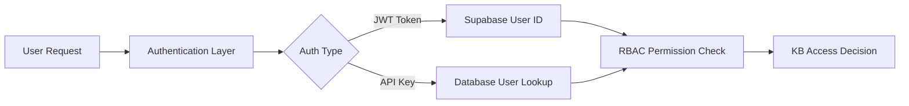

# User Account & RBAC Integration Guide


This document explains how user accounts are tied to access roles in our multi-user KB system.

## Authentication Flow



## 1. User Authentication Sources

### JWT Authentication (Primary)
```python
# When user logs in via web interface
{
    "auth_type": "jwt",
    "user_id": "550e8400-e29b-41d4-a716-446655440000",
    "scopes": ["full_access"]
}
```

### User-Associated API Keys
```python
# When user uses their personal API key
{
    "auth_type": "user_api_key", 
    "user_id": "550e8400-e29b-41d4-a716-446655440000",
    "api_key_id": "key_123",
    "scopes": ["kb_read", "kb_write"]
}
```

### Global API Keys (Admin/Service)
```python
# For service-to-service or admin access
{
    "auth_type": "api_key",
    "user_id": None,  # No specific user
    "scopes": ["admin"]
}
```

## 2. User Account Storage

Users are stored in the existing LLM Platform `users` table:

```sql
-- Users table (existing from LLM Platform)
CREATE TABLE users (
    id UUID PRIMARY KEY DEFAULT gen_random_uuid(),
    email VARCHAR(255) UNIQUE NOT NULL,
    name VARCHAR(255),
    is_active BOOLEAN DEFAULT true,
    created_at TIMESTAMP DEFAULT CURRENT_TIMESTAMP,
    updated_at TIMESTAMP DEFAULT CURRENT_TIMESTAMP
);
```

## 3. Role Assignment Process

### Automatic Role Assignment (New Users)
```python
# When a new user registers
async def create_user_with_default_role(email: str, name: str) -> str:
    user_id = await create_user(email, name)
    
    # Assign default role
    await rbac_manager.assign_role(
        user_id=user_id,
        role_name="kb_viewer",  # Default role
        assigned_by="system",
        context_type="global"
    )
    
    return user_id
```

### Manual Role Assignment (Admin Action)
```python
# Admin assigns specific role to user
await rbac_manager.assign_role(
    user_id="550e8400-e29b-41d4-a716-446655440000",
    role_name="kb_editor",
    assigned_by="admin_user_id",
    context_type="global"
)

# Or assign role in specific context (team/workspace)
await rbac_manager.assign_role(
    user_id="550e8400-e29b-41d4-a716-446655440000", 
    role_name="team_admin",
    assigned_by="admin_user_id",
    context_type="team",
    context_id="engineering_team_id"
)
```

## 4. Permission Check Flow

```python
# In KB service endpoints
async def kb_search_endpoint(request: ChatRequest, auth_principal: Dict[str, Any]):
    user_id = auth_principal.get("user_id")
    
    if settings.KB_MULTI_USER_ENABLED and user_id:
        # Check if user can search KB
        can_search = await rbac_manager.check_permission(
            user_id=user_id,
            resource_type=ResourceType.KB,
            resource_path="/kb/",
            action=Action.READ
        )
        
        if not can_search:
            raise HTTPException(status_code=403, detail="Permission denied")
        
        # Perform search with user context
        results = await kb_server.search_kb(query=query, user_id=user_id)
    else:
        # Single-user mode or admin access
        results = await kb_server.search_kb(query=query)
```

## 5. User Context in KB Operations

### User Namespace Access
```python
# User can access their private namespace
user_private_path = f"/kb/users/{user_id}/private/"

# Check access
has_access = await rbac_manager.check_kb_access(
    user_id=user_id,
    path=user_private_path,
    action=Action.READ
)
```

### Team/Workspace Access
```python
# Check if user is member of team
team_path = f"/kb/teams/{team_id}/docs/"
is_team_member = await rbac_manager.is_team_member(user_id, team_id)

if is_team_member:
    # User can access team KB
    team_docs = await kb_storage.search_documents(
        query=query,
        user_id=user_id,
        path_filter=team_path
    )
```

## 6. API Integration Examples

### FastAPI Endpoint with RBAC
```python
from fastapi import Depends
from app.shared.security import get_current_auth_legacy

@router.get("/kb/search")
async def search_kb(
    q: str,
    auth: dict = Depends(get_current_auth_legacy)
):
    user_id = auth.get("user_id")
    
    if not user_id:
        raise HTTPException(status_code=401, detail="Authentication required")
    
    # RBAC-filtered search
    results = await kb_storage_rbac.search_documents(
        query=q,
        user_id=user_id
    )
    
    return results
```

### Sharing Between Users
```python
@router.post("/kb/share")
async def share_document(
    request: ShareRequest,
    auth: dict = Depends(get_current_auth_legacy)
):
    sharer_id = auth.get("user_id")
    
    # Share document with specific users
    result = await kb_storage_rbac.share_document(
        path=request.path,
        shared_by=sharer_id,
        recipients=request.recipients,  # List of user IDs
        permissions=request.permissions
    )
    
    return result
```

## 7. User Management Commands

### Create User and Assign Role
```python
async def setup_new_user(email: str, name: str, role: str = "kb_viewer"):
    # Create user account
    user_id = str(uuid4())
    async with get_db_session() as session:
        await session.execute(
            text("""
                INSERT INTO users (id, email, name)
                VALUES (:id, :email, :name)
            """),
            {"id": user_id, "email": email, "name": name}
        )
        await session.commit()
    
    # Assign default role
    await rbac_manager.assign_role(
        user_id=user_id,
        role_name=role,
        assigned_by="system"
    )
    
    return user_id
```

### List User's Roles and Permissions
```python
async def get_user_permissions(user_id: str):
    # Get all roles for user
    roles = await rbac_manager.get_user_roles(user_id)
    
    # Check specific permissions
    kb_permissions = {
        "can_read": await rbac_manager.check_permission(
            user_id, ResourceType.KB, "/kb/", Action.READ
        ),
        "can_write": await rbac_manager.check_permission(
            user_id, ResourceType.KB, "/kb/", Action.WRITE
        ),
        "can_share": await rbac_manager.check_permission(
            user_id, ResourceType.KB, "/kb/", Action.SHARE
        )
    }
    
    return {
        "user_id": user_id,
        "roles": roles,
        "kb_permissions": kb_permissions
    }
```

## 8. Default Role Hierarchy

```
super_admin     # Full system access
├── admin       # Administrative access
├── developer   # API and service access
├── kb_admin    # Full KB management
├── kb_editor   # Create and edit KB content
├── kb_contributor # Contribute to assigned areas
├── kb_viewer   # Read-only KB access (DEFAULT)
└── guest       # Limited guest access
```

## 9. Integration Points

### 1. Authentication Layer (`app/shared/security.py`)
- Validates JWT tokens and API keys
- Extracts `user_id` from authentication
- Returns `AuthenticationResult` with user context

### 2. RBAC Manager (`app/shared/rbac.py`)
- Maps users to roles
- Checks permissions based on user context
- Handles team/workspace memberships

### 3. KB Service (`app/services/kb/`)
- Uses user context for all operations
- Filters results based on permissions
- Enforces user isolation

### 4. Database Schema
- `users` table: Core user accounts
- `user_roles` table: User → Role assignments
- `teams`/`workspaces`: Organizational contexts
- `resource_permissions`: Direct resource sharing

## 10. Testing User Integration

```python
# Create test user and verify access
async def test_user_kb_access():
    # Create test user
    user_id = await setup_new_user(
        email="test@example.com",
        name="Test User", 
        role="kb_editor"
    )
    
    # Test KB access
    can_read = await rbac_manager.check_kb_access(
        user_id=user_id,
        path=f"/kb/users/{user_id}/private/",
        action=Action.READ
    )
    
    assert can_read == True
    print(f"✓ User {user_id} can access their private KB")
```

This integration ensures that every KB operation is tied to a specific user account and their assigned roles, providing secure multi-user functionality while maintaining compatibility with existing authentication systems.