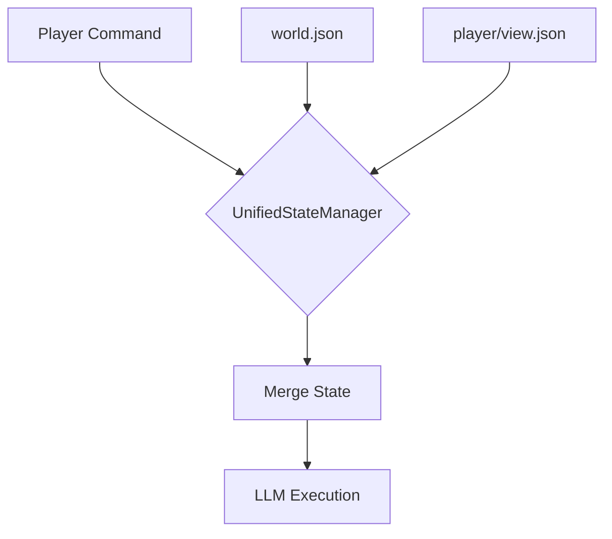
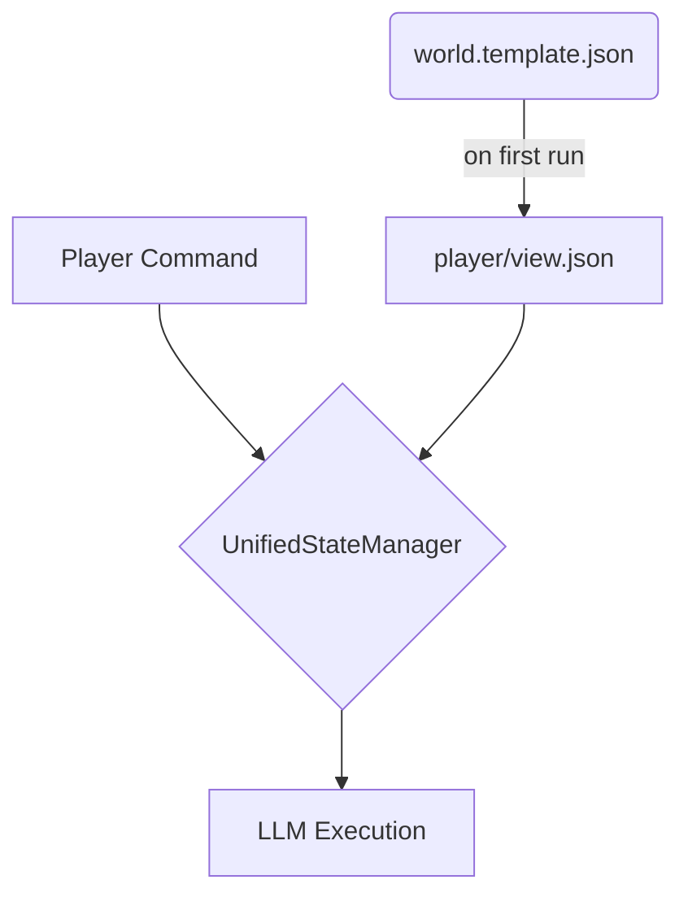

# Unified State Model: Deep Dive & Debugging Guide


**Purpose**: This document provides a deep architectural dive into the GAIA platform's dual state models (`shared` and `isolated`). It also serves as a critical debugging guide for common issues related to the Docker environment and content loading, based on real-world troubleshooting.

---

## 1. The Content Entity System: Blueprints, Templates, and Instances

To create a truly scalable and maintainable content system, the GAIA platform utilizes a three-tiered hierarchy for managing all game entities:

### 1.1. The Blueprint (The "Metaclass" or "Schema")

*   **What it is:** A blueprint defines the **structure and required fields** of a *template*. It is the "class of a class."
*   **Purpose:** It's a schema that tells the system what a valid "Item" template or a valid "Quest" template must contain. It enforces consistency *across templates*.
*   **Location:** `_meta/entity_blueprints/` (hypothetical directory for now)
*   **Analogy:** In programming, this is like an **abstract base class** or an **interface**. It defines the contract that all subclasses (templates) must adhere to.

### 1.2. The Template (The "Class")

*   **What it is:** A template is a **specific, reusable game entity definition**. It's a concrete implementation of a blueprint.
*   **Purpose:** It defines a specific *type* of thing that can exist in your game, like a "Health Potion" or the "Dream Bottle Recovery" quest. It contains all the shared attributes and narrative hooks for that entity.
*   **Location:** `templates/items/`, `templates/quests/`, etc.
*   **Analogy:** In programming, this is a **concrete class**. `class DreamBottle extends Item`.

### 1.3. The Instance (The "Object")

*   **What it is:** An instance is a **live, unique object in the game world** that is based on a template.
*   **Purpose:** It represents a specific dream bottle at a specific location with its own unique state (e.g., `collected_by: "jason@aeonia.ai"`).
*   **Location:** `instances/manifest.json` and the corresponding JSON instance file.
*   **Analogy:** In programming, this is an **object instance**. `myBottle = new DreamBottle()`.

### Summary Table

| Concept | Analogy | Purpose | Example File | What it Defines |
| :--- | :--- | :--- | :--- | :--- |
| **Blueprint** | Interface / Abstract Class | Defines the **structure of a template**. | `_meta/entity_blueprints/item.md` | "All items must have a description." |
| **Template** | Concrete Class | Defines a **specific type of entity**. | `templates/items/dream_bottle.md` | "A dream bottle is made of glass and glows." |
| **Instance** | Object Instance | Represents a **unique entity in the world**. | `instances/items/dream_bottle_1.json` | "This specific dream bottle is on the shelf." |

---

## 2. Architectural Deep Dive: The Dual State Models

Understanding the GAIA platform's dual state models (`shared` and `isolated`) is fundamental. This unique feature allows supporting two different types of player experiences from a single codebase, controlled by a single line in `config.json`.

### The Core Philosophy: Players as Views

*   **Shared Model (`wylding-woods`):** The world is a single, canonical entity (`world.json`). All players interact with this same world. A player's personal file (`view.json`) is just a "view" into that world, containing their unique state like inventory and location. **Think of it as a collaborative Google Doc.**

*   **Isolated Model (`west-of-house`):** Each player gets their own complete, independent copy of the world. The `world.template.json` serves as a blueprint. A player's `view.json` *is* their entire world. **Think of it as everyone getting their own copy of a Word template.**

### Visual Flowchart

**Shared Model Data Flow:**


**Isolated Model Data Flow:**


---

## 3. The Truth About the Local Development Environment

Understanding the interaction between the host machine, Docker, and the `kb-service` is the single most important factor in debugging this system.

### The Golden Rule of Local Development

**The `/kb` directory inside the `kb-service` container is a direct, real-time mirror of the `../../Vaults/gaia-knowledge-base` directory on your host machine.**

This is configured in `docker-compose.override.yml`:
```yaml
services:
  kb-service:
    volumes:
      - ../../Vaults/gaia-knowledge-base:/kb:rw
```

**Implications:**

1.  **Host is the Source of Truth:** All content (experiences, markdown, state files) is read directly from your host's file system.
2.  **`docker exec` and `docker cp` Modify the Host:** When you use `docker exec` to run `sed`, `mv`, or `cp` on the `/kb` directory, you are **directly modifying the files on your host machine** because of the volume mount.
3.  **Git Clone is Disabled Locally:** The `docker-compose.yml` instruction to clone from Git is ignored during local development because the override file takes precedence.

---

## 4. Debugging Common Test Failures

This section codifies the solutions to real issues encountered during development.

### Symptom: Tests fail with `Connection aborted` or `Remote end closed`

This is the most common and misleading error. It does **not** mean your test is wrong. It means the `kb-service` is not running or crashed during startup.

**Root Cause:** The `kb-service` is failing to start.

**Debugging Steps:**

1.  **Check the logs immediately.** This is the most important step.
    ```bash
    docker compose logs kb-service
    ```

2.  **Look for Startup Errors.** The most common error is a network failure when the semantic search feature tries to download models from Hugging Face.
    ```log
    kb-service-1  | '(MaxRetryError('HTTPSConnectionPool(host=\'huggingface.co\', port=443): Max retries exceeded... Failed to resolve \'huggingface.co\'...
    ```

**The Fix: Disable Semantic Search Locally**

The semantic search feature is not required for core gameplay logic. To allow the service to start, disable it for your local environment.

1.  **Edit `docker-compose.override.yml`:** This is the correct file for local settings.
2.  **Add the environment variable:**
    ```yaml
    services:
      kb-service:
        volumes:
          - ../../Vaults/gaia-knowledge-base:/kb:rw
        environment:
          KB_DEV_MODE: "true"
          KB_SEMANTIC_SEARCH_ENABLED: "false" # <-- Add this line
    ```
3.  **Restart the service to apply the change:**
    ```bash
    # Use this command to safely restart only the kb-service
    docker compose up -d --force-recreate kb-service
    ```

### Symptom: File Changes Are Not Being Detected

You've modified a `world.template.json` or a `look.md` file, but the game behaves as if the old version is still there.

**Root Cause:** The `UnifiedStateManager` (and other parts of the service) caches content in memory to improve performance. It does not automatically re-read files from disk on every request.

**The Fix: Restart the Service**

While there are cache-clearing endpoints (`/agent/cache/clear`), the most reliable and comprehensive way to ensure all content is reloaded from the host's volume mount is to restart the service.

```bash
# This forces the service to dump its in-memory cache and re-read all files on startup.
docker compose restart kb-service
```

**Workflow for Content Creators:**
1.  Edit your markdown or JSON files on your host machine (e.g., in VS Code or Obsidian).
2.  Run `docker compose restart kb-service`.
3.  Run your tests.

This simple loop is the most effective way to iterate on content and ensure your changes are loaded.

---

## 6. Refinement 1: Rich Descriptors in Templates

To create a more dynamic and less repetitive player experience, entity templates (like for items or NPCs) should be designed to provide the LLM with a rich set of **descriptive attributes** rather than a single, static `description` field. This allows the LLM to act as a "dungeon master," weaving unique, context-aware descriptions on the fly.

### Revised Item Template (`dream_bottle.md`)

Instead of just a `description` and `On Collection` narrative, the template should be structured like this:

```markdown
# Dream Bottle

> **Item ID**: dream_bottle
> **Type**: collectible

## Core Description
A small glass bottle that glows with an inner light, containing fragments of captured dreams.

## Descriptive Attributes
- **Material**: Translucent, hand-blown glass, slightly iridescent
- **Texture**: Smooth, cool to the touch, almost seamless
- **Weight**: Ethereal, nearly weightless, like holding a captured breath
- **Aura**: Pulses with a gentle, warm light; hums with a faint, pleasant vibration
- **Contents**: Swirling, luminescent mist; colors shift between purple and silver
- **Feeling**: Evokes a sense of wonder, nostalgia, and forgotten memories

## Symbol Variants (with unique sensory details)
- **Spiral (turquoise)**: Feels like creative energy; smells of ozone after a storm.
- **Star (golden)**: Feels like warm hope; smells of fresh-baked bread.
```

### How this changes the `look` command:

When a player examines an item, the `look.md` logic feeds these attributes to the LLM with a prompt like:

> "You are a dungeon master. A player is looking at a 'dream bottle'. Using the following attributes, write a fresh, engaging description (2-3 sentences):
>
> *   **Core:** A small glass bottle with glowing mist.
> *   **Material:** Translucent, iridescent glass.
> *   **Aura:** Pulses with warm light.
> *   **Context:** The player is in a dimly lit, dusty storeroom."

**Benefits:**
*   **Reduces Repetition:** The player gets a slightly different, context-aware description each time.
*   **Empowers the LLM:** Uses the LLM for its strength in creative language generation, while still being constrained by structured data.
*   **Richer World:** The game world feels more alive and responsive.

---

## 7. Refinement 2: Quests as Instantiable Classes

Thinking of quests as "classes" that can be "instantiated" for each user is the key to creating robust, personalized, and replayable storylines. This pattern separates the quest's definition from the player's progress.

### 1. The Quest "Class" (Template)

This is a markdown file in `templates/quests/` that defines the quest's structure, objectives, and rules, but contains no player-specific data.

**File: `templates/quests/dream_bottle_recovery.md`**
```markdown
# Quest: Dream Bottle Recovery

> **Quest ID**: dream_bottle_recovery
> **Type**: Collection
> **Prerequisites**: `trust_level` with `louisa` >= 60

## Description
Louisa the Dream Weaver's community has had their dreams stolen. The player must find the four scattered dream bottles and return them to their matching fairy houses.

## Objectives
1.  **Collect Bottle (Spiral):** Find `dream_bottle` with `symbol: spiral`.
2.  **Return Bottle (Spiral):** `return` the bottle to `fairy_door_1`.
    (...and so on for Star, Moon, and Sun)

## Rules
- Bottles can be returned in any order.
- The `return` command will fail if the bottle's symbol does not match the fairy house's symbol.

## Rewards
- **On Completion:** `+50 XP`, `Fairy Charm` item, `trust_level` with `louisa` set to 90.
```

### 2. The Quest "Instance" (Player-Specific State)

When a player accepts this quest, a new entry is created in their personal `progress.json` file. This is the "instance" of the quest, tracking *that player's* unique progress.

**File: `players/jason@aeonia.ai/progress.json`**
```json
{
  "user_id": "jason@aeonia.ai",
  "inventory": [...],
  "quest_instances": {
    "dream_bottle_recovery_1": {
      "template_id": "dream_bottle_recovery",
      "status": "in_progress",
      "started_at": "2025-10-31T02:00:00Z",
      "objectives_status": {
        "collect_bottle_spiral": "completed",
        "return_bottle_spiral": "completed",
        "collect_bottle_star": "pending"
      }
    }
  }
}
```

**Benefits:**
*   **Personalized Progress:** Each player has their own instance of the quest.
*   **Replayability:** A player can abandon a quest, and a new "instance" can be created later.
*   **Scalability:** The quest logic is defined once in the template and can be instantiated for thousands of players.
*   **Clear State Management:** The player's `progress.json` becomes a clean record of their active and completed quest instances.

---

## 4. Refinement 1: Rich Descriptors in Templates

To create a more dynamic and less repetitive player experience, entity templates (like for items or NPCs) should be designed to provide the LLM with a rich set of **descriptive attributes** rather than a single, static `description` field. This allows the LLM to act as a "dungeon master," weaving unique, context-aware descriptions on the fly.

### Revised Item Template (`dream_bottle.md`)

Instead of just a `description` and `On Collection` narrative, the template should be structured like this:

```markdown
# Dream Bottle

> **Item ID**: dream_bottle
> **Type**: collectible

## Core Description
A small glass bottle that glows with an inner light, containing fragments of captured dreams.

## Descriptive Attributes
- **Material**: Translucent, hand-blown glass, slightly iridescent
- **Texture**: Smooth, cool to the touch, almost seamless
- **Weight**: Ethereal, nearly weightless, like holding a captured breath
- **Aura**: Pulses with a gentle, warm light; hums with a faint, pleasant vibration
- **Contents**: Swirling, luminescent mist; colors shift between purple and silver
- **Feeling**: Evokes a sense of wonder, nostalgia, and forgotten memories

## Symbol Variants (with unique sensory details)
- **Spiral (turquoise)**: Feels like creative energy; smells of ozone after a storm.
- **Star (golden)**: Feels like warm hope; smells of fresh-baked bread.
```

### How this changes the `look` command:

When a player examines an item, the `look.md` logic feeds these attributes to the LLM with a prompt like:

> "You are a dungeon master. A player is looking at a 'dream bottle'. Using the following attributes, write a fresh, engaging description (2-3 sentences):
>
> *   **Core:** A small glass bottle with glowing mist.
> *   **Material:** Translucent, iridescent glass.
> *   **Aura:** Pulses with warm light.
> *   **Context:** The player is in a dimly lit, dusty storeroom."

**Benefits:**
*   **Reduces Repetition:** The player gets a slightly different, context-aware description each time.
*   **Empowers the LLM:** Uses the LLM for its strength in creative language generation, while still being constrained by structured data.
*   **Richer World:** The game world feels more alive and responsive.

---

## 5. Refinement 2: Quests as Instantiable Classes

Thinking of quests as "classes" that can be "instantiated" for each user is the key to creating robust, personalized, and replayable storylines. This pattern separates the quest's definition from the player's progress.

### 1. The Quest "Class" (Template)

This is a markdown file in `templates/quests/` that defines the quest's structure, objectives, and rules, but contains no player-specific data.

**File: `templates/quests/dream_bottle_recovery.md`**
```markdown
# Quest: Dream Bottle Recovery

> **Quest ID**: dream_bottle_recovery
> **Type**: Collection
> **Prerequisites**: `trust_level` with `louisa` >= 60

## Description
Louisa the Dream Weaver's community has had their dreams stolen. The player must find the four scattered dream bottles and return them to their matching fairy houses.

## Objectives
1.  **Collect Bottle (Spiral):** Find `dream_bottle` with `symbol: spiral`.
2.  **Return Bottle (Spiral):** `return` the bottle to `fairy_door_1`.
    (...and so on for Star, Moon, and Sun)

## Rules
- Bottles can be returned in any order.
- The `return` command will fail if the bottle's symbol does not match the fairy house's symbol.

## Rewards
- **On Completion:** `+50 XP`, `Fairy Charm` item, `trust_level` with `louisa` set to 90.
```

### 2. The Quest "Instance" (Player-Specific State)

When a player accepts this quest, a new entry is created in their personal `progress.json` file. This is the "instance" of the quest, tracking *that player's* unique progress.

**File: `players/jason@aeonia.ai/progress.json`**
```json
{
  "user_id": "jason@aeonia.ai",
  "inventory": [...],
  "quest_instances": {
    "dream_bottle_recovery_1": {
      "template_id": "dream_bottle_recovery",
      "status": "in_progress",
      "started_at": "2025-10-31T02:00:00Z",
      "objectives_status": {
        "collect_bottle_spiral": "completed",
        "return_bottle_spiral": "completed",
        "collect_bottle_star": "pending"
      }
    }
  }
}
```

**Benefits:**
*   **Personalized Progress:** Each player has their own instance of the quest.
*   **Replayability:** A player can abandon a quest, and a new "instance" can be created later.
*   **Scalability:** The quest logic is defined once in the template and can be instantiated for thousands of players.
*   **Clear State Management:** The player's `progress.json` becomes a clean record of their active and completed quest instances.

---

## Verification Status

**Verified By:** Gemini
**Date:** 2025-11-12

This document is a mix of accurate architectural descriptions, design proposals, and debugging advice. The following is a breakdown of its claims against the current codebase.

-   **✅ Content Entity System (Section 1):**
    *   **Claim:** The system uses a Template/Instance pattern.
    *   **Code Reference:** `app/services/kb/template_loader.py` and `app/services/kb/unified_state_manager.py`.
    *   **Verification:** This is **VERIFIED**. The `template_loader.py` loads markdown templates, and the `unified_state_manager.py` merges them with instance data.
    *   **Claim:** The system uses a "Blueprint" concept as a schema for templates.
    *   **Verification:** This is **NOT VERIFIED**. There is no code that implements or enforces a blueprint schema for templates. This appears to be a conceptual description or a future design goal.

-   **✅ Architectural Deep Dive: The Dual State Models (Section 2):**
    *   **Claim:** The system supports "shared" and "isolated" state models based on `config.json`.
    *   **Code Reference:** `app/services/kb/unified_state_manager.py` (lines 501-541, `get_world_state` method).
    *   **Verification:** This is **VERIFIED**. The `get_world_state` method correctly reads from `world.json` for the "shared" model and the player-specific `view.json` for the "isolated" model.

-   **✅ The Truth About the Local Development Environment (Section 3):**
    *   **Claim:** The `docker-compose.override.yml` file mounts the host's `../../Vaults/gaia-knowledge-base` directory to `/kb` in the `kb-service` container.
    *   **Code Reference:** `docker-compose.override.yml.example`.
    *   **Verification:** This is **VERIFIED**. The example override file contains the exact volume mount specified.

-   **⚠️ Debugging Common Test Failures (Section 4):**
    *   **Claim:** To fix `Connection aborted` errors, `KB_SEMANTIC_SEARCH_ENABLED: "false"` should be added to `docker-compose.override.yml`.
    *   **Code Reference:** `docker-compose.override.yml.example`.
    *   **Verification:** This is a **DISCREPANCY**. The `docker-compose.override.yml.example` file does **not** contain this environment variable. A user following this guide would need to add it manually.
    *   **Claim:** Restarting the `kb-service` is the most reliable way to load file changes.
    *   **Verification:** This is **VERIFIED**. The code in `unified_state_manager.py` and `template_loader.py` uses in-memory caches (`_config_cache`, and the cache within the `template_loader`), which would be cleared upon a service restart.

-   **⚠️ Refinements (Sections 6 & 7):**
    *   **Claim:** Templates should have "Rich Descriptors" for the LLM to use.
    *   **Verification:** This is **NOT VERIFIED**. The `template_loader.py` does not have specific logic to parse "Descriptive Attributes" or "Symbol Variants" from markdown. This appears to be a design proposal for future implementation.
    *   **Claim:** Quests are instantiable classes, with progress tracked in the player's `progress.json`.
    *   **Code Reference:** `app/services/kb/unified_state_manager.py` (lines 932-966, `_create_minimal_player_view`) and `app/services/kb/kb_agent.py` (lines 1783-1791, `_return_item`).
    *   **Verification:** This is **VERIFIED**. The `_create_minimal_player_view` method initializes a `progress.quest_states` object, and the `_return_item` method in the agent updates `player_state["quest_progress"]`, confirming the implementation of player-specific quest instances.

**Overall Conclusion:** The document is a valuable resource but should be read with the understanding that it mixes implemented architecture with design proposals. The debugging advice is helpful but contains a minor omission in the example file.

