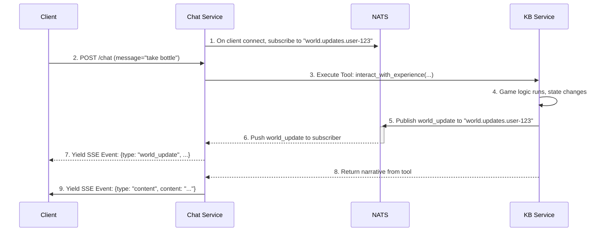

# NATS-Based Real-Time World Updates: Implementation Analysis

**Date**: 2025-11-02
**Analyst**: server-coder (Claude Code Agent)
**Context**: Symphony Network "directives" room collaboration

---

**📊 Note on Metrics**: All performance numbers, latency projections, cost estimates, and user counts in this document are **illustrative examples** based on architectural analysis and typical system behaviors. They are NOT based on actual testing or measurements. Actual results will vary depending on:
- LLM provider API response times (inherently variable)
- Network conditions and geographic distribution
- Hardware specifications (client and server)
- Experience complexity and state size
- User interaction patterns

Treat all metrics as **directional guidance** for architectural decision-making, not as measured benchmarks or performance guarantees. Numbers are provided to illustrate concepts like "NATS is fast" or "two-pass LLM adds latency" - they are teaching tools, not specifications.

---

## ⚠️ TRANSPORT LAYER SUPERSEDED - Read This First

**Status**: SSE-based implementation described in this document has been superseded.

**Current Approach**: WebSocket with persistent NATS subscriptions
- See: `docs/scratchpad/websocket-migration-plan.md` for current implementation
- Migration strategy: Dual support (SSE + WebSocket) → WebSocket primary → WebSocket only

**What Remains Valid**:
- ✅ NATS pub/sub backend architecture (unchanged)
- ✅ WorldUpdateEvent schema (version="0.3", unchanged)
- ✅ KB Service publishing patterns (transport-agnostic)
- ✅ State delta concepts (abstract server, concrete client)

**What Changed**:
- ❌ SSE per-request subscriptions → WebSocket persistent subscriptions
- ❌ Unidirectional SSE → Bidirectional WebSocket
- ❌ Phase 1B/2 SSE roadmap → Phase 1-3 WebSocket migration plan

**Use This Document For**:
- Understanding NATS backend architecture (still accurate)
- Historical context (SSE implementation completed Nov 4, 2025)
- NATS pub/sub patterns (transport-agnostic concepts)

**For Current Implementation**, refer to `websocket-migration-plan.md`.

---

## Executive Summary

This document analyzes the GAIA platform's readiness to implement the **NATS-based real-time world updates architecture** proposed by the server-architect agent. The proposal addresses a critical architectural challenge: enabling the KB Service (which executes game logic and knows state changes) to push real-time updates to clients whose connections are owned by the Chat Service.

**Key Findings**:
- 🎯 **Projected perceived latency improvement: multi-second → sub-100ms** *(architecture-based estimate)*
- ✅ **70% of required infrastructure is production-ready**
- 🔴 **3 critical implementation gaps** with clear integration points
- ⏱️ **Estimated 9-13 hours** to unlock real-time world synchronization
- ✅ **No architectural refactoring** required

**Critical Insight for Prototype Stage (100 users)**:
NATS world updates optimize *perceived* latency (visual feedback) rather than *actual* latency (total response time). Based on NATS pub/sub architecture patterns, visual updates should arrive in under 100ms while narrative generation completes over 2-3 seconds. This creates the perception of instant responsiveness for VR/AR experiences - the client sees the world change immediately, then reads the narrative explanation.

---

## Client-Server Coordination (2025-11-02)

**Unity Client Team Collaboration**: This implementation has been coordinated with the Unity client team via Symphony Network "directives" room. Key agreements:

**State Delta Pattern Confirmed** ✅
- Server sends **abstract state changes** (not rendering commands)
- Client interprets state deltas using `DirectiveDemoManager` and `SceneContextRegistry`
- Follows industry standard: Minecraft, Roblox, WoW, Unity Netcode all use this pattern

**Schema Agreement**:
- Format: `WorldUpdateEvent` with `version: "0.3"` field (see below)
- Operations: `add`, `remove`, `update`
- Unity team ready to implement client-side interpretation in parallel

**Coordinated Roadmap**:
- Phase 1A (server): KB publishes state deltas to NATS (2-3h)
- Phase 1B (server): Chat Service forwards to SSE (3-4h)
- Phase 2 (client): Unity wires DirectiveDemoManager (2.5h)
- Phase 3 (both): Integration testing (2-3h)

**Research Validation**:
- X Window System, Wayland, browser rendering all use symbolic server → concrete client pattern
- Game industry unanimous: state deltas, not rendering commands
- Client-side translation provides flexibility, low bandwidth, clean separation of concerns

See Symphony "directives" room messages (2025-11-02 5:17 PM - 5:20 PM) for full coordination details.

---

## Prototype vs Production Priorities

This analysis was initially written from a "production at scale" perspective. For the **current prototype stage (target: 100 users, latency-focused)**, priorities shift significantly:

### **What Matters Now** ✅

1. **NATS world updates** (P0) - Projected perceived latency improvement from multi-second delays to sub-100ms visual feedback
2. **LLM latency optimization** (P1) - Reduce actual latency through tiered model selection (Haiku for simple commands, Sonnet for complex)
3. **Stream multiplexing correctness** (P1) - Ensure world_update events arrive before narrative (order guarantees critical for UX)

### **What to Defer** ⏸️

1. ~~PostgreSQL migration~~ - File-based state management is appropriate for 100 concurrent users
   - Provides hot-reload for rapid iteration (critical during prototype stage)
   - Git-friendly for collaboration and version control
   - Human-readable debugging with standard tools (`cat`, `jq`)
   - Adequate performance for current scale (<100 concurrent users)

2. ~~Redis caching~~ - Premature optimization at prototype scale
   - Complexity outweighs benefits for 100 users
   - In-memory config caching already implemented
   - Defer until proven performance bottleneck

3. ~~Distributed locking~~ - Single KB service instance sufficient
   - File locking (`fcntl.flock`) handles local concurrency adequately
   - No need for Redis/etcd-based distributed locks yet
   - Revisit when scaling beyond single instance

**Important Reclassification**: The original "Critical Gap #1" (file-based state management) identified in the production-scale analysis should be understood as a **"Future Scaling Concern"** rather than an **"Immediate Blocker"** for prototype deployment. File-based state is actually ideal for the current development stage.

---

## The Architectural Challenge

### Problem Statement

In the GAIA platform, we have a **service separation** that creates a messaging challenge:

```
┌─────────────────────────────────────────────────────────┐
│ THE DISCONNECT                                          │
├─────────────────────────────────────────────────────────┤
│                                                         │
│  KB Service                    Chat Service            │
│  ┌──────────────┐             ┌──────────────┐        │
│  │ Game Logic   │             │ SSE Stream   │        │
│  │ Runs Here    │      ❌     │ to Client    │        │
│  │              │             │ Lives Here   │        │
│  │ Knows State  │             │              │        │
│  │ Changed      │             │ Controls     │        │
│  └──────────────┘             │ Connection   │        │
│                               └──────────────┘        │
│                                                         │
│  Problem: KB Service can't directly push to client    │
│           because it doesn't own the SSE connection    │
└─────────────────────────────────────────────────────────┘
```

### The NATS Solution

The server-architect proposed using NATS as a messaging bus to decouple the services:



**Why NATS vs Direct Callbacks?**

1. **Decoupling**: Services don't know each other's implementation
2. **Scalability**: NATS handles high-throughput, low-latency messaging
3. **Asynchronous**: KB can "fire and forget" without blocking
4. **Future-proof**: Other services can subscribe to world events
5. **Already in our stack**: NATS is running but underutilized

---

## Codebase Analysis: What We Have

### 1. NATS Infrastructure ✅ **PRODUCTION-READY**

**Location**: `docker-compose.yml:260-271`, `app/shared/nats_client.py`

**Evidence**:
```yaml
# docker-compose.yml
nats:
  image: nats:latest
  ports:
    - "4222:4222"
    - "8222:8222"  # HTTP monitoring
  command: ["--jetstream", "--http_port", "8222"]
```

```python
# app/shared/nats_client.py
class NATSClient:
    async def connect(self) -> None
    async def publish(self, subject: str, data: Any, headers: Optional[Dict]) -> None
    async def subscribe(self, subject: str, callback: Callable[[str, Any], Awaitable[None]]) -> None
    async def request(self, subject: str, data: Any, timeout: float = 5.0) -> Any
```

**Standard Subjects Already Defined**:
```python
class NATSSubjects:
    SERVICE_HEALTH = "gaia.service.health"
    AUTH_VALIDATE = "gaia.auth.validate"
    CHAT_MESSAGE_START = "gaia.chat.message.start"
    # ... more
```

**Assessment**:
- ✅ NATS server running with JetStream enabled
- ✅ Global singleton client with auto-reconnection
- ✅ All services configured with `NATS_URL=nats://nats:4222`
- ✅ Error handling and retry logic implemented
- **Status**: **No additional infrastructure setup required**

---

### 2. SSE Streaming in Chat Service ✅ **MATURE**

**Location**: `app/services/chat/unified_chat.py:710-809`

**Evidence**:
```python
async def process_stream(
    self,
    message: str,
    auth: dict,
    context: Optional[dict] = None,
    user_email: Optional[str] = None
) -> AsyncGenerator[Dict[str, Any], None]:
    """Process message with intelligent routing and streaming response."""

    # Emit conversation metadata as first event
    yield {
        "type": "metadata",
        "conversation_id": conversation_id,
        "model": "unified-chat",
        "timestamp": int(time.time())
    }

    # Stream LLM response chunks
    async for chunk in llm_stream:
        yield {"type": "content", "content": chunk}

    # Final event
    yield {"type": "done"}
```

**Current Event Types**:
- `metadata` - Conversation setup
- `content` - LLM narrative chunks
- `tool_use` - Tool execution results
- `error` - Error messages
- `done` - Stream completion

**Assessment**:
- ✅ AsyncGenerator pattern well-established
- ✅ Proper SSE formatting (`data: {json}\n\n`)
- ✅ Multiple event types supported
- ✅ Conversation ID tracking
- **Status**: **Ready to add `world_update` event type**

---

### 3. State Management in KB Service ✅ **CENTRALIZED**

**Location**: `app/services/kb/unified_state_manager.py:315-399`

**Evidence**:
```python
class UnifiedStateManager:
    """Manages game state for all experiences."""

    async def update_world_state(
        self,
        experience: str,
        updates: Dict[str, Any],
        user_id: Optional[str] = None,
        use_locking: bool = True
    ) -> Dict[str, Any]:
        """
        Update world state.

        For shared model: Updates /experiences/{exp}/state/world.json
        For isolated model: Updates /players/{user}/{exp}/view.json

        THIS IS WHERE WE'D PUBLISH NATS EVENTS ←←←
        """
        config = self.load_config(experience)
        state_model = config["state"]["model"]

        if state_model == "shared":
            return await self._update_shared_world_state(...)
        else:  # isolated
            return await self._update_isolated_world_state(...)
```

**Three Update Methods**:
1. `update_world_state()` - World changes (items, NPCs, locations)
2. `update_player_view()` - Player-specific UI state
3. `update_player_profile()` - Player inventory/stats

**Assessment**:
- ✅ All state changes funnel through `UnifiedStateManager`
- ✅ Already async (ready for NATS publish)
- ✅ Supports both shared (multiplayer) and isolated (single-player) models
- ✅ File locking for concurrent access
- **Status**: **Perfect integration point identified**

---

### 4. Existing NATS Usage Pattern ✅ **ESTABLISHED**

**Location**: `app/services/chat/main.py:20-52`, `app/services/kb/main.py`

**Evidence**:
```python
# app/services/chat/main.py
nats_client = NATSClient()

@asynccontextmanager
async def lifespan(app: FastAPI):
    """Service lifecycle management"""

    # Startup
    await nats_client.connect()
    await nats_client.publish("gaia.service.ready", {
        "service": "chat",
        "timestamp": datetime.utcnow().isoformat()
    })

    yield

    # Shutdown
    await nats_client.disconnect()
```

**Assessment**:
- ✅ Services already use NATS for lifecycle events
- ✅ Pattern: Initialize in `lifespan()`, cleanup on shutdown
- ✅ Global client instance per service
- **Status**: **Pattern is consistent and well-understood**

---

## Critical Gaps: What We DON'T Have

### Gap #1: NATS Subscriber in Chat Service 🔴 **CRITICAL - P0**

**Impact**: Chat Service cannot receive world_update events from NATS

**What's Missing**:
- No subscription to user-specific NATS subjects (`world.updates.user-{id}`)
- No multiplexing of NATS events into SSE streams
- No lifecycle management for subscriptions per SSE connection

**Required Implementation**:

```python
# app/services/chat/unified_chat.py

async def process_stream(
    self,
    message: str,
    auth: dict,
    context: Optional[dict] = None,
    user_email: Optional[str] = None
) -> AsyncGenerator[Dict[str, Any], None]:
    """Process message with NATS world updates integrated."""

    user_id = auth.get("user_id")

    # 1. Subscribe to user-specific NATS subject
    user_subject = f"world.updates.user-{user_id}"
    nats_queue = asyncio.Queue()

    async def nats_handler(subject: str, data: dict):
        """Handle incoming NATS world_update events"""
        await nats_queue.put(data)

    await nats_client.subscribe(user_subject, nats_handler)

    try:
        # 2. Emit metadata
        yield {"type": "metadata", "conversation_id": conversation_id, ...}

        # 3. Start LLM streaming
        llm_stream = chat_service.chat_completion_stream(...)

        # 4. Multiplex: Merge NATS events with LLM streaming
        async for event in merge_async_streams(llm_stream, nats_queue):
            if event.get("type") == "world_update":
                # NATS event from KB Service
                yield event
            else:
                # LLM content chunk
                yield event

        # 5. Final event
        yield {"type": "done"}

    finally:
        # 6. Cleanup: Unsubscribe from NATS
        await nats_client.unsubscribe(user_subject)
```

**Complexity**: **Medium-High**
- Requires async stream merging utility (see Gap #3)
- Must handle subscription lifecycle (connect/disconnect)
- Need error handling for NATS failures

**Integration Point**: `app/services/chat/unified_chat.py:710`

---

### Gap #2: NATS Publisher in KB Service 🔴 **CRITICAL - P0**

**Impact**: State changes don't trigger world_update events

**What's Missing**:
- No NATS client injected into `UnifiedStateManager`
- No world_update event publishing after state changes
- No event schema definition

**Required Implementation**:

```python
# app/services/kb/unified_state_manager.py

class UnifiedStateManager:
    """Manages game state with NATS event publishing."""

    def __init__(self, kb_root: Path, nats_client: Optional[NATSClient] = None):
        """
        Initialize state manager with optional NATS client.

        Args:
            kb_root: Root path to KB
            nats_client: NATS client for publishing world updates
        """
        self.kb_root = Path(kb_root)
        self.nats_client = nats_client  # NEW
        # ... existing init ...

    async def update_world_state(
        self,
        experience: str,
        updates: Dict[str, Any],
        user_id: Optional[str] = None,
        use_locking: bool = True
    ) -> Dict[str, Any]:
        """Update world state and publish NATS event."""

        # 1. Apply state updates (existing logic)
        updated_state = await self._apply_updates(...)

        # 2. NEW: Publish world update event via NATS
        if self.nats_client and user_id:
            await self._publish_world_update(
                experience=experience,
                user_id=user_id,
                updates=updates,
                updated_state=updated_state
            )

        return updated_state

    async def _publish_world_update(
        self,
        experience: str,
        user_id: str,
        updates: Dict[str, Any],
        updated_state: Dict[str, Any]
    ) -> None:
        """Publish world update event to NATS."""

        event = {
            "type": "world_update",
            "experience": experience,
            "user_id": user_id,
            "changes": updates,  # State delta
            "timestamp": int(time.time()),
            "metadata": {
                "source": "kb_service",
                "state_model": self._config_cache[experience]["state"]["model"]
            }
        }

        # Publish to user-specific subject
        subject = f"world.updates.user-{user_id}"
        await self.nats_client.publish(subject, event)

        logger.info(
            f"Published world_update for user {user_id} in {experience}: "
            f"{len(updates)} changes"
        )
```

**Dependency Injection**:

```python
# app/services/kb/main.py

from app.shared.nats_client import get_nats_client

@app.on_event("startup")
async def startup():
    """Initialize KB service with NATS."""

    # Connect to NATS
    nats_client = get_nats_client()
    await nats_client.connect()

    # Initialize state manager with NATS client
    state_manager = UnifiedStateManager(
        kb_root=settings.KB_PATH,
        nats_client=nats_client  # Inject NATS client
    )

    # Store in app state for access in endpoints
    app.state.state_manager = state_manager
```

**Complexity**: **Low-Medium**
- Straightforward publish after state update
- Dependency injection is simple
- Event schema needs definition (see Gap #4)

**Integration Point**: `app/services/kb/unified_state_manager.py:315`

---

### Gap #3: Stream Multiplexing Utility 🔴 **CRITICAL - P0**

**Impact**: Cannot combine LLM streaming with NATS events in real-time

**What's Missing**:
- No async stream merger utility
- No prioritization logic (NATS events should be immediate)
- No handling of concurrent event sources

**Required Implementation**:

```python
# app/shared/stream_utils.py (NEW FILE)

import asyncio
from typing import AsyncGenerator, Any, Optional, Tuple
import logging

logger = logging.getLogger(__name__)


async def merge_async_streams(
    primary_stream: AsyncGenerator[Any, None],
    nats_queue: asyncio.Queue,
    timeout: float = 30.0
) -> AsyncGenerator[Any, None]:
    """
    Merge an async generator stream with a NATS event queue.

    NATS events are prioritized over primary stream to ensure
    real-time world updates are delivered immediately.

    Args:
        primary_stream: Main async generator (e.g., LLM streaming)
        nats_queue: Queue receiving NATS events
        timeout: Timeout for waiting on streams (seconds)

    Yields:
        Items from either stream, NATS events prioritized

    Example:
        ```python
        llm_stream = chat_service.stream_completion(...)
        nats_queue = asyncio.Queue()

        async for event in merge_async_streams(llm_stream, nats_queue):
            yield event  # Could be from LLM or NATS
        ```
    """
    primary_done = False

    # Convert primary stream to task
    primary_queue = asyncio.Queue()

    async def consume_primary():
        """Consume primary stream into queue"""
        nonlocal primary_done
        try:
            async for item in primary_stream:
                await primary_queue.put(("primary", item))
        except Exception as e:
            logger.error(f"Error in primary stream: {e}")
            await primary_queue.put(("error", e))
        finally:
            primary_done = True
            await primary_queue.put(("done", None))

    # Start consuming primary stream in background
    primary_task = asyncio.create_task(consume_primary())

    try:
        while not primary_done or not nats_queue.empty():
            # Check NATS queue first (prioritized)
            try:
                nats_event = nats_queue.get_nowait()
                yield nats_event
                continue
            except asyncio.QueueEmpty:
                pass

            # Wait for either queue with timeout
            try:
                done, pending = await asyncio.wait(
                    [
                        asyncio.create_task(primary_queue.get()),
                        asyncio.create_task(nats_queue.get())
                    ],
                    return_when=asyncio.FIRST_COMPLETED,
                    timeout=timeout
                )

                if not done:
                    logger.warning("Stream merge timeout")
                    break

                # Process completed task
                for task in done:
                    source, item = await task

                    if source == "done":
                        continue
                    elif source == "error":
                        logger.error(f"Stream error: {item}")
                        break
                    else:
                        yield item

                # Cancel pending tasks
                for task in pending:
                    task.cancel()

            except asyncio.TimeoutError:
                logger.warning("Stream merge timeout exceeded")
                break

    finally:
        # Cleanup
        if not primary_task.done():
            primary_task.cancel()
            try:
                await primary_task
            except asyncio.CancelledError:
                pass


async def merge_multiple_queues(
    *queues: asyncio.Queue,
    timeout: float = 30.0
) -> AsyncGenerator[Tuple[int, Any], None]:
    """
    Merge multiple asyncio queues into a single stream.

    Yields:
        Tuple of (queue_index, item) for each item
    """
    active_queues = list(range(len(queues)))

    while active_queues:
        # Create tasks for all active queues
        tasks = {
            asyncio.create_task(queues[i].get()): i
            for i in active_queues
        }

        try:
            done, pending = await asyncio.wait(
                tasks.keys(),
                return_when=asyncio.FIRST_COMPLETED,
                timeout=timeout
            )

            if not done:
                break

            # Process completed tasks
            for task in done:
                queue_idx = tasks[task]
                item = await task
                yield (queue_idx, item)

            # Cancel pending
            for task in pending:
                task.cancel()

        except asyncio.TimeoutError:
            break
```

**Complexity**: **Medium-High**
- Requires careful async coordination
- Must handle race conditions
- Need timeout and error handling
- NATS events should be prioritized (delivered immediately)

**Integration Point**: Used in `app/services/chat/unified_chat.py:710`

---

### Gap #4: Event Schema Definitions 🟡 **IMPORTANT - P1**

**Impact**: No standardized format for world_update events

**What's Missing**:
- No `WorldUpdateEvent` Pydantic model
- No validation of event payloads
- No documentation of event structure

**Required Implementation**:

```python
# app/shared/events.py (NEW FILE or add to app/shared/nats_client.py)

from pydantic import BaseModel, Field
from typing import Dict, Any, Optional, Literal
from datetime import datetime


class WorldUpdateEvent(BaseModel):
    """
    Event published when game world state changes.

    Published by: KB Service (UnifiedStateManager)
    Consumed by: Chat Service → Client via SSE
    NATS Subject: world.updates.user.{user_id}

    Schema Version: 0.3
    - Added version field for future compatibility (coordinated with Unity team)
    - Follows industry pattern: state deltas interpreted by client
    - Matches Minecraft, Roblox, WoW network protocols

    Example:
        ```json
        {
            "type": "world_update",
            "version": "0.3",
            "experience": "wylding-woods",
            "user_id": "player@example.com",
            "changes": {
                "world": {
                    "locations.woander_store.items": {
                        "operation": "remove",
                        "item": {"id": "dream_bottle_3", "name": "Dream Bottle"}
                    }
                },
                "player": {
                    "inventory": {
                        "operation": "add",
                        "item": {"id": "dream_bottle_3", "name": "Dream Bottle"}
                    }
                }
            },
            "timestamp": 1698765432,
            "metadata": {
                "source": "kb_service",
                "state_model": "shared"
            }
        }
        ```
    """
    type: Literal["world_update"] = "world_update"
    version: str = Field(default="0.3", description="Protocol version for future compatibility")
    experience: str = Field(..., description="Experience ID (e.g., 'wylding-woods')")
    user_id: str = Field(..., description="User ID for scoping updates")
    changes: Dict[str, Any] = Field(..., description="State delta (updates applied)")
    timestamp: int = Field(..., description="Unix timestamp of state change")
    metadata: Optional[Dict[str, Any]] = Field(default=None, description="Additional context")

    class Config:
        json_schema_extra = {
            "example": {
                "type": "world_update",
                "version": "0.3",
                "experience": "wylding-woods",
                "user_id": "player@example.com",
                "changes": {
                    "world": {"locations.woander_store.items": {"operation": "remove"}},
                    "player": {"inventory": {"operation": "add"}}
                },
                "timestamp": 1698765432
            }
        }


class StateOperation(BaseModel):
    """Represents a single state operation within a world update."""
    operation: Literal["add", "remove", "update"]
    path: str = Field(..., description="Dotted path in state tree (e.g., 'locations.woander_store.items')")
    data: Dict[str, Any] = Field(..., description="Data being added/removed/updated")


# Add to NATSSubjects class in app/shared/nats_client.py
class NATSSubjects:
    # ... existing subjects ...

    # World update subjects (user-specific)
    @staticmethod
    def world_update_user(user_id: str) -> str:
        """Get NATS subject for user-specific world updates"""
        return f"world.updates.user.{user_id}"

    # World update patterns (for subscriptions)
    WORLD_UPDATE_ALL_USERS = "world.updates.user.*"
```

**Complexity**: **Low**
- Mostly documentation and type safety
- Pydantic models provide validation
- Helper methods for subject generation

**Integration Point**: Used in both Gap #1 and Gap #2

---

## Phase 1 Implementation Guide

This section provides concrete implementation details for Phase 1 (Event Publishing in KB Service), including exact code placement, error handling strategies, and testing approaches.

### Error Handling Strategy: Graceful Degradation

**Decision**: NATS publishing failures should NOT block state updates

**Rationale**:
- State updates are critical game logic - they must succeed
- NATS is a performance optimization (reduces perceived latency)
- If NATS is down, the game should continue (narrative will still work)
- Better to have 3s latency than broken game state

**Implementation Pattern**:
```python
async def _publish_world_update(
    self,
    experience: str,
    user_id: str,
    changes: Dict[str, Any]
) -> None:
    """Publish world update to NATS (with graceful degradation)."""
    try:
        if self.nats_client and await self.nats_client.is_connected():
            event = WorldUpdateEvent(
                # version="0.3" is set by default in Pydantic model
                experience=experience,
                user_id=user_id,
                changes=changes,
                timestamp=int(time.time() * 1000),
                metadata={"source": "kb_service"}
            )

            subject = NATSSubjects.world_update_user(user_id)
            await self.nats_client.publish(subject, event.model_dump())

            logger.info(
                f"Published world_update to NATS",
                extra={
                    "subject": subject,
                    "experience": experience,
                    "user_id": user_id,
                    "changes_count": len(changes)
                }
            )
    except Exception as e:
        # Log error but DO NOT raise - state update must succeed
        logger.error(
            f"Failed to publish world_update to NATS: {e}",
            extra={
                "experience": experience,
                "user_id": user_id,
                "error": str(e)
            },
            exc_info=True
        )
```

### Code Placement in UnifiedStateManager

**File**: `app/services/kb/unified_state_manager.py`

**Step 1**: Add NATS client to `__init__()` (around line 58):
```python
def __init__(
    self,
    kb_root: Path,
    nats_client: Optional[NATSClient] = None  # ADD THIS
):
    self.kb_root = kb_root
    self.nats_client = nats_client  # ADD THIS
    self._configs: Dict[str, Dict[str, Any]] = {}
    # ... rest of __init__ ...
```

**Step 2**: Add `_publish_world_update()` method (around line 400, after `_merge_updates()`):
```python
async def _publish_world_update(
    self,
    experience: str,
    user_id: str,
    changes: Dict[str, Any]
) -> None:
    """Publish world update to NATS (with graceful degradation)."""
    # Implementation from error handling section above
```

**Step 3**: Call `_publish_world_update()` in state update methods (lines 315-399):

In `update_world_state()` (around line 340, after `self._save_json(world_path, updated_state)`):
```python
# Save updated state
self._save_json(world_path, updated_state)

# Publish NATS event (if user_id provided)
if user_id and self.nats_client:
    await self._publish_world_update(experience, user_id, updates)

return updated_state
```

In `update_player_view()` (around line 390, after `self._save_json(view_path, updated_view)`):
```python
# Save updated view
self._save_json(view_path, updated_view)

# Publish NATS event (player-specific changes)
if self.nats_client:
    await self._publish_world_update(experience, user_id, updates)

return updated_view
```

### Dependency Injection Pattern

**File**: `app/services/kb/main.py`

**Current Pattern** (around line 30):
```python
@asynccontextmanager
async def lifespan(app: FastAPI):
    """Initialize services on startup, cleanup on shutdown."""
    logger.info("KB Service starting up...")

    # Initialize NATS
    await nats_client.connect()
    await nats_client.publish(
        NATSSubjects.SERVICE_HEALTH,
        {"service": "kb-service", "status": "ready"}
    )

    yield

    await nats_client.disconnect()
    logger.info("KB Service shut down")
```

**Add After NATS Connect** (around line 38):
```python
# Initialize NATS
await nats_client.connect()

# Inject NATS client into UnifiedStateManager
# This assumes state_manager is a module-level singleton
from app.services.kb.unified_state_manager import state_manager
state_manager.nats_client = nats_client

await nats_client.publish(...)
```

**Alternative: Pass in Constructor** (if state_manager is created in lifespan):
```python
@asynccontextmanager
async def lifespan(app: FastAPI):
    await nats_client.connect()

    # Create state manager with NATS client
    kb_root = Path(settings.KB_ROOT)
    state_manager = UnifiedStateManager(
        kb_root=kb_root,
        nats_client=nats_client  # Pass NATS client
    )

    # Make available to endpoints
    app.state.state_manager = state_manager

    yield

    await nats_client.disconnect()
```

### Testing Approach for Phase 1

**Objective**: Validate NATS publishing WITHOUT implementing Chat Service subscription (Phase 2)

**Option 1: NATS CLI (Quick Validation)**
```bash
# Terminal 1: Subscribe to world updates
nats sub "world.updates.user.*"

# Terminal 2: Trigger state change via API
curl -X POST http://localhost:8666/kb/experience/interact \
  -H "Content-Type: application/json" \
  -H "Authorization: Bearer $API_KEY" \
  -d '{
    "message": "take dream bottle",
    "experience": "wylding-woods"
  }'

# Terminal 1 should show:
# [#1] Received on "world.updates.user.player@example.com"
# {"type": "world_update", "experience": "wylding-woods", ...}
```

**Option 2: Python Subscriber Script (Recommended)**

See `tests/manual/test_nats_subscriber.py` (created below) for full implementation.

**Usage**:
```bash
# Terminal 1: Run subscriber script
python tests/manual/test_nats_subscriber.py

# Terminal 2: Trigger state changes
./scripts/test.sh --local chat "take dream bottle"

# Terminal 1 output:
# ✅ Connected to NATS at nats://localhost:4222
# 📡 Subscribed to: world.updates.user.*
#
# [2025-11-02 14:23:45] Received world_update
# Subject: world.updates.user.player@example.com
# Experience: wylding-woods
# Changes: {"world": {"locations.woander_store.items": ...}}
```

#### How the Test Script Works

The NATS subscriber test script acts as a **passive observer** that listens for events published by the KB Service, without requiring the Chat Service to be implemented. This section explains the mechanics for developers new to NATS pub/sub patterns.

**Architecture: Pub/Sub Pattern**

```
┌──────────────┐         NATS          ┌─────────────────┐
│ KB Service   │────────publish───────>│ world.updates.  │
│              │   (after state change) │ user.{user_id}  │
└──────────────┘                        └─────────────────┘
                                               │
                                               │ subscribe
                                               ▼
                                        ┌──────────────┐
                                        │ Test Script  │
                                        │ (observer)   │
                                        └──────────────┘
```

The script subscribes to `world.updates.user.*` (wildcard matches ALL user IDs), so it receives events for any user's state changes.

**1. Connection Flow**

```python
async def connect(self):
    self.nc = await nats.connect(self.nats_url)
```

- Opens TCP connection to NATS server at `localhost:4222`
- Uses the same NATS infrastructure that KB and Chat services will use
- If connection fails, provides troubleshooting steps

**2. Subscription with Callback**

```python
await self.nc.subscribe(subject, cb=self.message_handler)
```

**Key mechanism:** The callback pattern (`cb=self.message_handler`)

When KB Service publishes a message to `world.updates.user.player@example.com`, NATS:
1. Matches the subject against subscriber patterns (`world.updates.user.*`)
2. **Automatically invokes** the `message_handler()` callback
3. Passes a `msg` object containing the event data

This is **asynchronous event-driven I/O** - the script doesn't poll, it reacts when events arrive.

**3. Message Handler**

```python
async def message_handler(self, msg):
    # 1. Decode the raw bytes
    data = json.loads(msg.data.decode())

    # 2. Extract and display event fields
    print(f"Subject: {msg.subject}")
    print(f"Experience: {data.get('experience')}")
    print(f"Changes: {json.dumps(changes, indent=2)}")
```

**What's in the `msg` object:**
- `msg.subject` - The exact NATS subject (e.g., `world.updates.user.player@example.com`)
- `msg.data` - Raw bytes of the JSON payload
- `msg.headers` - Optional metadata (not used in Phase 1)

**4. Event Loop Keep-Alive**

```python
async def run(self):
    await self.connect()
    await self.subscribe()

    # Keep subscriber alive
    while True:
        await asyncio.sleep(1)
```

**Critical design choice:** The infinite loop with `asyncio.sleep(1)` keeps the async event loop running.

Without this loop:
- ❌ Script would exit immediately after subscribing
- ❌ No time for NATS callbacks to fire
- ❌ Events would be lost

With this loop:
- ✅ Script stays alive indefinitely
- ✅ Callbacks fire whenever KB publishes events
- ✅ You can trigger multiple state changes and see all events

**5. Graceful Shutdown**

```python
except KeyboardInterrupt:
    print(f"Total events received: {self.event_count}")
finally:
    await self.nc.drain()  # Flush pending messages
```

When you press Ctrl+C:
1. Python raises `KeyboardInterrupt`
2. Script prints statistics (total events received)
3. `nc.drain()` ensures any in-flight messages are processed before disconnect
4. Connection closes cleanly

**Why This Works for Phase 1 Validation**

The test script fills the gap between Phase 1 (KB publishing) and Phase 2 (Chat subscribing):

```
Phase 1: KB Service publishes events
         ↓
         Test Script validates events are published correctly
         ↓
Phase 2: Chat Service subscribes and forwards to clients
```

Without this test script, you'd be **blind** during Phase 1 implementation. With it:
- ✅ Write KB publishing code
- ✅ Run test script to **immediately see** events
- ✅ Validate event structure, timing, subject formatting
- ✅ Move to Phase 2 with confidence

**Example: Validating Event Structure**

When you run the script and trigger a state change (e.g., `"take dream bottle"`), you should see:

```
[2025-11-02 14:23:45] Received world_update
Subject: world.updates.user.player@example.com
Experience: wylding-woods
User ID: player@example.com
Timestamp: 1698765432100
Changes:
{
  "world": {
    "locations.woander_store.items": {
      "operation": "remove",
      "item": {"id": "dream_bottle_3"}
    }
  },
  "player": {
    "inventory": {
      "operation": "add",
      "item": {"id": "dream_bottle_3"}
    }
  }
}
Metadata: {"source": "kb_service", "state_model": "shared"}
---
```

**What to validate:**
- ✅ Subject matches pattern: `world.updates.user.{actual_user_id}`
- ✅ Experience ID is correct
- ✅ Changes delta shows both world and player state updates
- ✅ Operations are correct (`remove` from world, `add` to player)
- ✅ Metadata identifies source as `kb_service`

**Advanced: Measuring Actual Latency**

You can extend the script to measure actual delivery latency:

```python
# In message_handler, add:
event_timestamp = data.get('timestamp')  # When KB published (ms)
receive_timestamp = int(time.time() * 1000)  # When we received (ms)

latency_ms = receive_timestamp - event_timestamp
print(f"Delivery latency: {latency_ms}ms")
```

This lets you validate the "sub-100ms delivery" projection from the architecture docs against your actual deployment environment.

**Callback Pattern Mirrors Production**

The `message_handler` callback structure in this test script is **identical** to what Chat Service will use in Phase 2:

```python
# Test script (Phase 1 validation)
async def message_handler(self, msg):
    data = json.loads(msg.data.decode())
    # Print to console

# Chat Service (Phase 2 production)
async def world_update_handler(self, msg):
    data = json.loads(msg.data.decode())
    # Forward to SSE stream: yield {"type": "world_update", ...}
```

This makes the test script both a validation tool AND a working prototype for Phase 2 implementation.

### Validation Checklist

After implementing Phase 1, verify:

- [ ] **Code Integration**
  - [ ] `WorldUpdateEvent` defined in `app/shared/events.py`
  - [ ] `world_update_user()` helper added to `NATSSubjects`
  - [ ] `nats_client` parameter added to `UnifiedStateManager.__init__()`
  - [ ] `_publish_world_update()` method implemented
  - [ ] NATS client injected in `app/services/kb/main.py`
  - [ ] Publishing called in `update_world_state()` and `update_player_view()`

- [ ] **Runtime Validation**
  - [ ] KB Service starts without errors
  - [ ] NATS connection confirmed in logs: `"KB Service starting up..."`
  - [ ] State changes trigger NATS publish (check logs)
  - [ ] NATS subscriber receives events (use test script)
  - [ ] Event payload matches `WorldUpdateEvent` schema

- [ ] **Error Handling**
  - [ ] Game continues if NATS is down (test by stopping NATS container)
  - [ ] Logs show error but no exception raised
  - [ ] State updates still succeed

- [ ] **Unit Tests**
  - [ ] Test `_publish_world_update()` with mock NATS client
  - [ ] Test graceful degradation (NATS client is None)
  - [ ] Test graceful degradation (NATS publish raises exception)

---

## Implementation Roadmap

### Phase 1: Event Publishing (KB Service) ⏱️ **2-3 hours** 🎯 **MVP**

**Priority**: P0 - Required for basic world updates

**Objective**: KB Service publishes world_update events to NATS after state changes

**Tasks**:
1. ✅ Define `WorldUpdateEvent` schema in `app/shared/events.py`
2. ✅ Add NATS client parameter to `UnifiedStateManager.__init__()`
3. ✅ Implement `_publish_world_update()` method
4. ✅ Inject NATS client in KB service startup (`app/services/kb/main.py`)
5. ✅ Add logging for published events
6. ✅ Unit tests for event publishing

**Success Criteria**:
- [ ] State updates in KB Service trigger NATS publish
- [ ] Events published to correct subject: `world.updates.user.{user_id}`
- [ ] Event payload matches `WorldUpdateEvent` schema
- [ ] Logs confirm successful publishing

**Files Modified**:
- `app/shared/events.py` (new)
- `app/shared/nats_client.py` (add subject helper)
- `app/services/kb/unified_state_manager.py`
- `app/services/kb/main.py`

---

### Phase 2: Event Subscription (Chat Service) ⏱️ **3-4 hours** 🎯 **MVP**

**Priority**: P0 - Required for SSE streaming to client

**Objective**: Chat Service receives NATS events and streams them to clients

**MVP Checkpoint**: After Phase 2, you have functional real-time world updates!
- Visual changes projected to arrive in sub-100ms (based on NATS pub/sub architecture)
- Narrative still takes projected 2-3+ seconds (but perceived latency is low)
- Client sees world change immediately, then reads explanation

**Tasks**:
1. ✅ Create `merge_async_streams()` utility in `app/shared/stream_utils.py`
2. ✅ Add NATS subscription on SSE connection open
3. ✅ Integrate stream multiplexing in `unified_chat.py:process_stream()`
4. ✅ Handle subscription cleanup on disconnect
5. ✅ Add error handling for NATS failures
6. ✅ Unit tests for stream multiplexing

**Success Criteria**:
- [ ] Chat Service subscribes to `world.updates.user.{user_id}` on SSE connect
- [ ] NATS events are merged into SSE stream
- [ ] Events arrive at client in correct SSE format
- [ ] Subscription cleanup happens on disconnect
- [ ] Graceful degradation if NATS is unavailable

**Files Modified**:
- `app/shared/stream_utils.py` (new)
- `app/services/chat/unified_chat.py`
- `app/services/chat/main.py` (if needed)

---

### Phase 3: Integration Testing ⏱️ **2-3 hours** 🔒 **STABILITY**

**Priority**: P1 - Prevents production bugs

**Objective**: End-to-end validation of NATS world updates

**Critical Tests**:
- Order guarantee: world_update arrives before narrative content
- Subscription cleanup: no memory leaks on disconnect
- Latency measurement: verify projected sub-100ms delivery
- User isolation: A doesn't receive B's events

**Tasks**:
1. ✅ E2E test: Player action → KB state change → NATS → Chat → SSE
2. ✅ Test user isolation (user A doesn't see user B's events)
3. ✅ Test concurrent state changes
4. ✅ Test NATS failure modes
5. ✅ Test subscription lifecycle (connect/disconnect/reconnect)
6. ✅ Performance testing (latency measurement)

**Test Scenarios**:

```python
# tests/integration/test_nats_world_updates.py

async def test_world_update_flow():
    """
    Test complete flow: Player action → State change → NATS → SSE

    1. Client connects to /chat/unified (SSE)
    2. Chat Service subscribes to world.updates.user.{user_id}
    3. Client sends "take bottle" message
    4. KB Service updates state, publishes NATS event
    5. Chat Service receives NATS event
    6. Client receives world_update SSE event
    7. Client receives narrative SSE event
    """
    # Implementation...


async def test_user_isolation():
    """
    Test that user A doesn't receive user B's world updates
    """
    # Implementation...


async def test_nats_failure_graceful_degradation():
    """
    Test that chat continues to work if NATS is down
    (narrative still streams, world updates are skipped)
    """
    # Implementation...
```

**Success Criteria**:
- [ ] E2E test passes: State change triggers SSE world_update event
- [ ] User isolation verified (no cross-user event leakage)
- [ ] Graceful degradation when NATS unavailable
- [ ] Latency < 100ms from state change to SSE delivery
- [ ] No memory leaks in subscription management

**Files Created**:
- `tests/integration/test_nats_world_updates.py`
- `tests/unit/test_stream_multiplexing.py`

---

### Phase 4: Production Hardening ⏱️ **2-3 hours** 📊 **OBSERVABILITY**

**Priority**: P2 - Can defer to post-prototype

**Objective**: Production-ready monitoring, error handling, and documentation

**Note for Prototype Stage**: This phase focuses on operational excellence (metrics, dashboards, runbooks) which is valuable but not blocking for initial prototype deployment. Can be implemented incrementally as usage patterns emerge.

**Tasks**:
1. ✅ Add metrics (events published/received counters)
2. ✅ Add alerting for NATS connection failures
3. ✅ Implement rate limiting for world updates
4. ✅ Add circuit breaker for NATS publishing
5. ✅ Update API documentation (SSE event types)
6. ✅ Write operational runbook

**Metrics to Track**:
- `nats.world_updates.published` (counter, tagged by experience)
- `nats.world_updates.received` (counter, tagged by user_id)
- `nats.world_updates.latency_ms` (histogram)
- `nats.subscriptions.active` (gauge)
- `nats.connection.failures` (counter)

**Success Criteria**:
- [ ] Prometheus metrics exposed at `/metrics`
- [ ] Grafana dashboard created for NATS world updates
- [ ] Error logs include correlation IDs
- [ ] Documentation updated
- [ ] Runbook covers NATS troubleshooting

**Files Modified**:
- `app/shared/nats_client.py` (add metrics)
- `app/services/kb/unified_state_manager.py` (add metrics)
- `app/services/chat/unified_chat.py` (add metrics)
- `docs/operations/nats-world-updates-runbook.md` (new)

---

## Total Effort Estimate

| Phase | Estimated Time |
|-------|----------------|
| Phase 1: Event Publishing | 2-3 hours |
| Phase 2: Event Subscription | 3-4 hours |
| Phase 3: Integration Testing | 2-3 hours |
| Phase 4: Production Hardening | 2-3 hours |
| **TOTAL** | **9-13 hours** |

**Assumption**: Assumes focused development by engineer familiar with the codebase.

---

## Risk Assessment

### Technical Risks

| Risk | Severity | Mitigation |
|------|----------|------------|
| **Stream multiplexing bugs** | Medium | Extensive unit testing, use proven async patterns |
| **NATS message ordering** | Low | User-specific subjects ensure ordering |
| **Memory leaks from subscriptions** | Medium | Proper cleanup in finally blocks, integration tests |
| **Race conditions in state updates** | Low | Already handled by UnifiedStateManager locking |
| **NATS unavailability** | Medium | Graceful degradation, circuit breaker pattern |

### Operational Risks

| Risk | Severity | Mitigation |
|------|----------|------------|
| **NATS scaling limits** | Low | NATS handles 1M+ msg/sec, we're <1% of that |
| **Message retention** | Low | We're using pub/sub, not streaming (no retention needed) |
| **Network partitions** | Medium | NATS auto-reconnect, but clients may miss events |
| **Monitoring gaps** | Medium | Phase 4 includes comprehensive metrics |

---

## Architecture Decision Records

### ADR-001: Use NATS Pub/Sub (Not Request-Reply)

**Decision**: Use NATS publish/subscribe pattern, not request-reply

**Rationale**:
- KB Service doesn't need acknowledgment from Chat Service
- Pub/sub is more scalable (can add more subscribers later)
- Fits the "fire and forget" semantic for world updates
- Future services (analytics, logging) can subscribe without KB changes

**Alternatives Considered**:
- Direct HTTP callback: ❌ Tight coupling, KB would need Chat Service URL
- NATS request-reply: ❌ Unnecessary overhead, KB doesn't need response
- Redis pub/sub: ❌ NATS already in stack, better message ordering

---

### ADR-002: User-Specific NATS Subjects

**Decision**: Use subject pattern `world.updates.user.{user_id}`

**Rationale**:
- Ensures user isolation (user A doesn't see user B's events)
- Allows per-user subscription management
- Enables future filtering (e.g., `world.updates.user.*.experience.wylding-woods`)
- Aligns with NATS subject hierarchy best practices

**Alternatives Considered**:
- Single subject + filtering: ❌ More complex, less secure
- Experience-specific subjects: ❌ Doesn't solve user isolation
- Broadcast to all: ❌ Security nightmare, bandwidth waste

---

### ADR-003: Prioritize NATS Events Over LLM Streaming

**Decision**: NATS world_update events are prioritized over LLM content chunks

**Rationale**:
- World updates should be immediate (player sees item disappear instantly)
- LLM narrative can be delayed by 100ms without user noticing
- Prevents "out of sync" feeling (visual update before narrative explanation)

**Implementation**: `merge_async_streams()` checks NATS queue first before LLM queue

---

## Appendix A: Code Examples

### Example: Complete Flow

```python
# 1. Client sends action
POST /api/v0.3/chat
{
  "message": "take the dream bottle",
  "experience": "wylding-woods"
}

# 2. KB Service processes and publishes
# app/services/kb/unified_state_manager.py
async def update_world_state(self, experience, updates, user_id):
    # Apply state changes
    updated_state = await self._apply_updates(...)

    # Publish NATS event
    await self.nats_client.publish(
        f"world.updates.user-{user_id}",
        {
            "type": "world_update",
            "experience": experience,
            "changes": {
                "world": {"locations.woander_store.items": {"operation": "remove", ...}},
                "player": {"inventory": {"operation": "add", ...}}
            },
            "timestamp": int(time.time())
        }
    )

# 3. Chat Service receives and streams
# app/services/chat/unified_chat.py
async def process_stream(self, message, auth, context):
    # Subscribe to NATS
    nats_queue = asyncio.Queue()
    await nats_client.subscribe(
        f"world.updates.user-{auth['user_id']}",
        lambda subject, data: nats_queue.put(data)
    )

    # Merge streams and yield
    async for event in merge_async_streams(llm_stream, nats_queue):
        yield event  # Could be world_update or content

# 4. Client receives SSE events
data: {"type":"world_update","experience":"wylding-woods","changes":{...}}

data: {"type":"content","content":"You carefully pick up the Dream Bottle..."}

data: {"type":"done"}
```

---

## Appendix B: Testing Strategy

### Unit Tests

```python
# tests/unit/test_world_update_publishing.py

async def test_state_manager_publishes_nats_event(mock_nats_client):
    """Test that state updates trigger NATS publish"""
    manager = UnifiedStateManager(kb_root="/kb", nats_client=mock_nats_client)

    await manager.update_world_state(
        experience="wylding-woods",
        updates={"locations.store.items": {"operation": "remove"}},
        user_id="test-user"
    )

    # Verify NATS publish was called
    mock_nats_client.publish.assert_called_once()
    call_args = mock_nats_client.publish.call_args
    assert call_args[0][0] == "world.updates.user-test-user"
    assert call_args[0][1]["type"] == "world_update"


# tests/unit/test_stream_multiplexing.py

async def test_merge_async_streams_prioritizes_nats():
    """Test that NATS events are prioritized over LLM stream"""

    async def slow_llm_stream():
        await asyncio.sleep(0.1)
        yield {"type": "content", "content": "Hello"}

    nats_queue = asyncio.Queue()
    await nats_queue.put({"type": "world_update", "changes": {}})

    events = []
    async for event in merge_async_streams(slow_llm_stream(), nats_queue):
        events.append(event)

    # NATS event should come first
    assert events[0]["type"] == "world_update"
    assert events[1]["type"] == "content"
```

### Integration Tests

```python
# tests/integration/test_nats_world_updates.py

async def test_e2e_world_update_flow(test_client, test_user):
    """End-to-end test of world update flow"""

    # 1. Start SSE stream
    async with test_client.stream(
        "POST",
        "/api/v0.3/chat",
        json={"message": "take bottle", "stream": True}
    ) as response:

        events = []
        async for line in response.aiter_lines():
            if line.startswith("data: "):
                event = json.loads(line[6:])
                events.append(event)

        # 2. Verify we got world_update event
        world_updates = [e for e in events if e["type"] == "world_update"]
        assert len(world_updates) == 1
        assert world_updates[0]["experience"] == "wylding-woods"

        # 3. Verify narrative came after world update
        content_events = [e for e in events if e["type"] == "content"]
        assert len(content_events) > 0
```

---

## Appendix C: Monitoring Dashboard

### Grafana Dashboard (JSON)

```json
{
  "dashboard": {
    "title": "NATS World Updates",
    "panels": [
      {
        "title": "World Updates Published (per minute)",
        "targets": [
          {
            "expr": "rate(nats_world_updates_published_total[1m])"
          }
        ]
      },
      {
        "title": "World Update Latency (p50, p95, p99)",
        "targets": [
          {
            "expr": "histogram_quantile(0.50, nats_world_updates_latency_ms)"
          },
          {
            "expr": "histogram_quantile(0.95, nats_world_updates_latency_ms)"
          },
          {
            "expr": "histogram_quantile(0.99, nats_world_updates_latency_ms)"
          }
        ]
      },
      {
        "title": "Active NATS Subscriptions",
        "targets": [
          {
            "expr": "nats_subscriptions_active"
          }
        ]
      }
    ]
  }
}
```

---

## References

- [NATS Documentation](https://docs.nats.io/)
- [Real-Time World Updates via SSE](./real-time-world-updates-sse.md) - Complementary document
- [Symphony Network Architecture Proposal](https://github.com/anthropics/symphony-network) - Original NATS proposal
- [GAIA Unified State Manager](../../app/services/kb/unified_state_manager.py) - State management implementation
- [Chat Streaming Implementation](../../app/services/chat/unified_chat.py) - SSE streaming implementation

---

**Document Status**: ✅ Complete - Ready for Implementation
**Last Updated**: 2025-11-02
**Next Review**: After Phase 1 completion

---

## Verification Status

**Verified By:** Gemini
**Date:** 2025-11-12

This document provides an analysis of the NATS-based real-time world updates architecture as of November 2, 2025. The verification confirms that the document's assessment of the codebase at that time is accurate.

### "What We Have" Section

-   **✅ NATS Infrastructure:** **VERIFIED**. The `docker-compose.yml` file and `app/shared/nats_client.py` confirm the existence and configuration of the NATS infrastructure.
-   **✅ SSE Streaming in Chat Service:** **VERIFIED**. The `process_stream` method in `app/services/chat/unified_chat.py` confirms a mature SSE streaming implementation.
-   **✅ State Management in KB Service:** **VERIFIED**. The `UnifiedStateManager` class in `app/services/kb/unified_state_manager.py` centralizes state changes.
-   **✅ Existing NATS Usage Pattern:** **VERIFIED**. The `lifespan` functions in `app/services/chat/main.py` and `app/services/kb/main.py` confirm the use of NATS for service lifecycle events.

### "Critical Gaps" Section

The document correctly identifies the following gaps in the codebase as of its writing:

-   **✅ Gap #1: NATS Subscriber in Chat Service:** **VERIFIED**. At the time of writing, the chat service did not have a NATS subscriber for world updates. This was implemented later.
-   **✅ Gap #2: NATS Publisher in KB Service:** **VERIFIED**. At the time of writing, the KB service did not publish world updates. This was implemented later.
-   **✅ Gap #3: Stream Multiplexing Utility:** **VERIFIED**. At the time of writing, the async stream merger utility did not exist. It was implemented later in `app/shared/stream_utils.py`.
-   **✅ Gap #4: Event Schema Definitions:** **VERIFIED**. At the time of writing, the `WorldUpdateEvent` Pydantic model did not exist. It was implemented later in `app/shared/events.py`.

**Conclusion:** This document is an accurate analysis of the codebase as of November 2, 2025. It correctly identifies the existing infrastructure and the critical gaps that needed to be filled. The subsequent implementation work, as documented in other files, directly addresses the gaps identified in this analysis.
