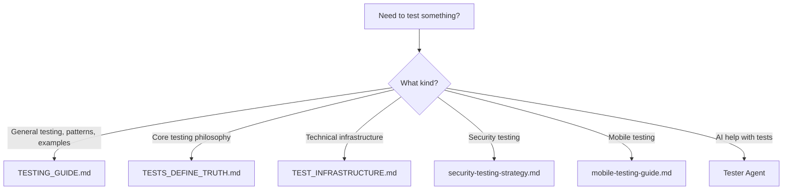

# GAIA Testing Documentation

## 🚀 Quick Start

```bash
# Run all tests (async to avoid timeouts)
./scripts/pytest-for-claude.sh

# Monitor test progress
./scripts/check-test-progress.sh

# Run specific test categories
./scripts/pytest-for-claude.sh tests/unit -v        # Unit tests (fast)
./scripts/pytest-for-claude.sh tests/integration -v # Integration tests
./scripts/pytest-for-claude.sh tests/e2e -v        # End-to-end tests
```

**⚠️ CRITICAL**: Always use `./scripts/pytest-for-claude.sh` - NEVER use `pytest` directly (it will timeout after 2 minutes in Claude Code).

## 📚 Documentation Structure

### Core Documentation (5 Essential Files)
- **[TESTING_GUIDE.md](TESTING_GUIDE.md)** - **MAIN GUIDE** - Comprehensive testing documentation with patterns and best practices
- **[CRITICAL_TESTING_PRINCIPLE_TESTS_DEFINE_TRUTH.md](CRITICAL_TESTING_PRINCIPLE_TESTS_DEFINE_TRUTH.md)** - Core testing philosophy
- **[TEST_INFRASTRUCTURE.md](TEST_INFRASTRUCTURE.md)** - Technical details about test runners and tools

### Specialized Guides
- **[security-testing-strategy.md](security-testing-strategy.md)** - Security-focused testing approach
- **[mobile-testing-guide.md](mobile-testing-guide.md)** - Testing on mobile devices

### AI Assistant
- **[Tester Agent](/.claude/agents/tester.md)** - AI assistant with comprehensive testing knowledge, patterns, and debugging expertise


## 🎯 Which Document Do I Need?



## 🗂️ Test Organization

```
tests/
├── unit/               # Fast, isolated unit tests
├── integration/        # Service integration tests
├── e2e/               # End-to-end tests with real auth
├── web/               # Browser-based UI tests
└── fixtures/          # Shared test utilities
```

## 🔑 Key Concepts

1. **Async Test Execution**: Tests run in background to avoid Claude Code's 2-minute timeout
2. **Real Authentication**: E2E tests use real Supabase auth, not mocks
3. **Service Isolation**: Each microservice has its own test suite
4. **Progressive Testing**: Unit → Integration → E2E

## 📊 Current Test Coverage

- **Unit Tests**: 83+ tests covering core components
- **Integration Tests**: Service interaction testing
- **E2E Tests**: Real user flows with authentication
- **Browser Tests**: UI behavior verification

## 🛠️ Common Tasks

### Writing New Tests
1. Check [TESTING_GUIDE.md](TESTING_GUIDE.md) for patterns and examples
2. Use the [Tester Agent](/.claude/agents/tester.md) for AI assistance: `/agents:tester`
3. Follow TDD: Write failing test → Implement → Refactor

### Debugging Failed Tests
```bash
# View test output
tail -f logs/tests/pytest/test-run-*.log

# Run specific failing test
./scripts/pytest-for-claude.sh tests/path/to/test.py::test_name -v -s
```

### Adding Test Fixtures
See [TESTING_GUIDE.md](TESTING_GUIDE.md) for fixture patterns and the [Tester Agent](/.claude/agents/tester.md) for guidance

## 🚨 Important Notes

1. **Never commit failing tests** - Fix or skip with `@pytest.mark.skip`
2. **Use real services for E2E** - No mocking in end-to-end tests
3. **Clean up test data** - Tests should not leave artifacts
4. **Check resource usage** - Monitor Docker resources during tests

## 📈 Testing Philosophy

**Core Principle**: Automated tests over manual scripts

```bash
# ❌ Bad: Manual testing
curl -H "X-API-Key: $API_KEY" http://localhost:8666/api/v1/chat

# ✅ Good: Automated test
./scripts/pytest-for-claude.sh tests/integration/test_chat_api.py -v
```

For more details, see [TESTING_GUIDE.md](TESTING_GUIDE.md).

---

**Last Updated**: August 2025  
**Maintainer**: GAIA Development Team